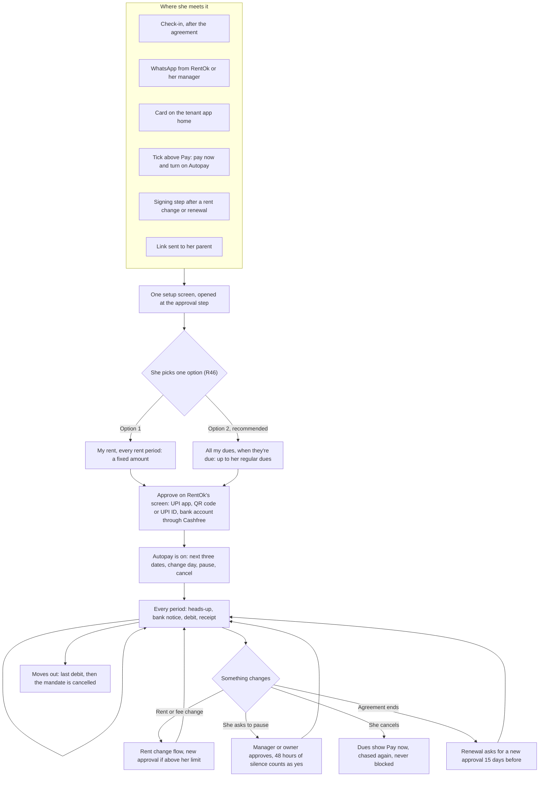
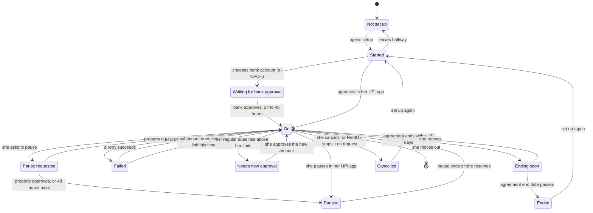
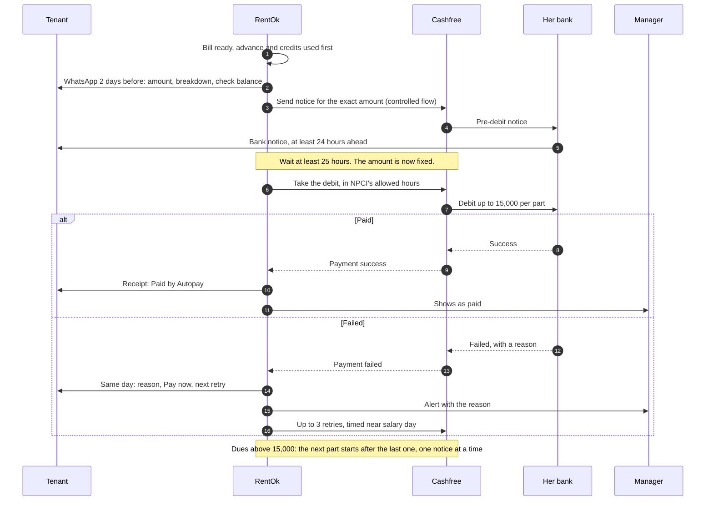
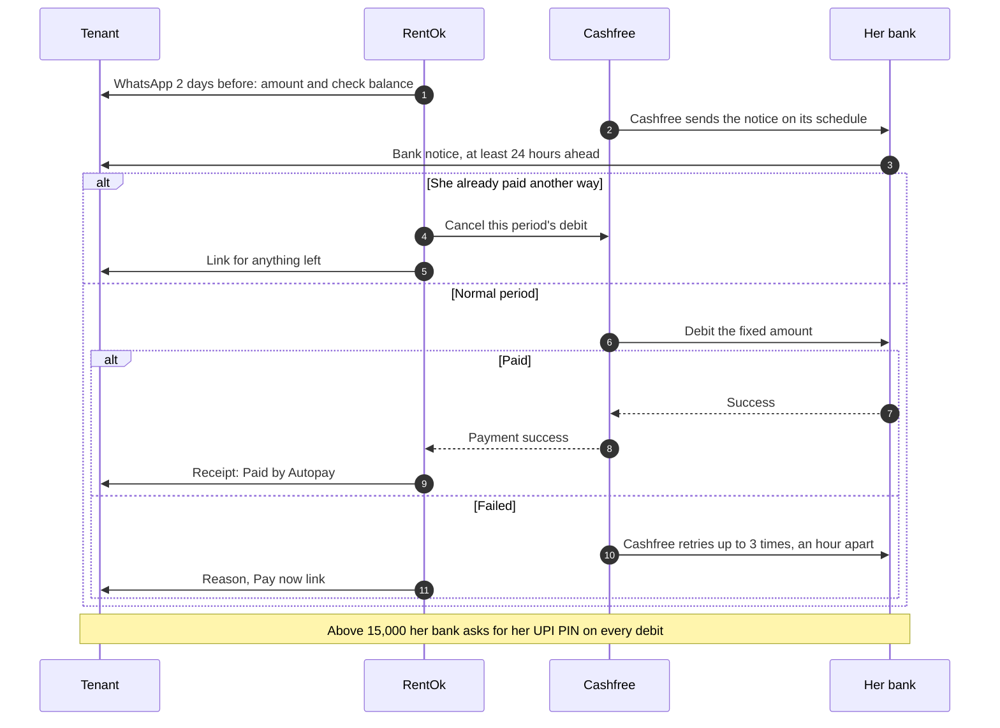
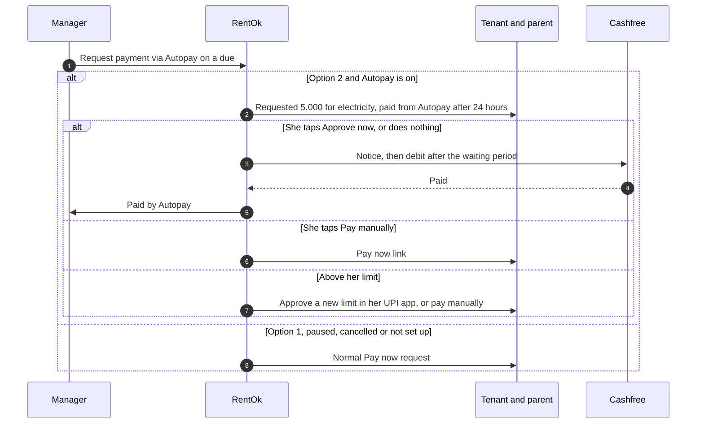
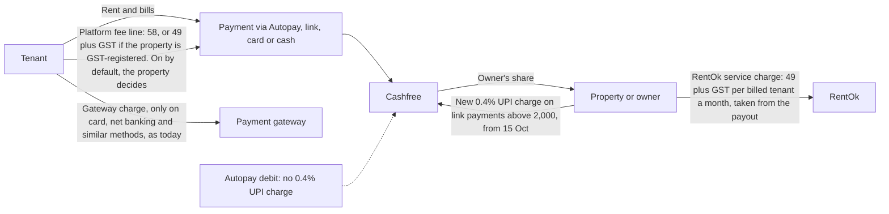
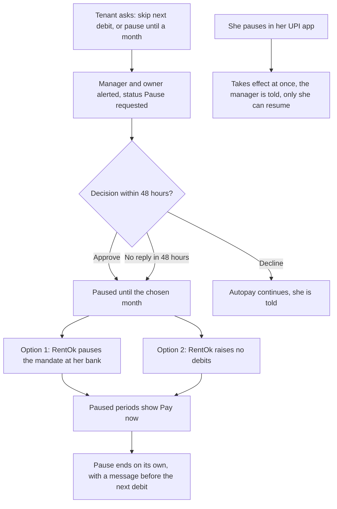
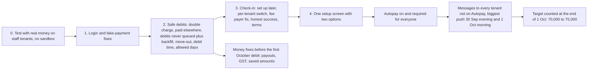
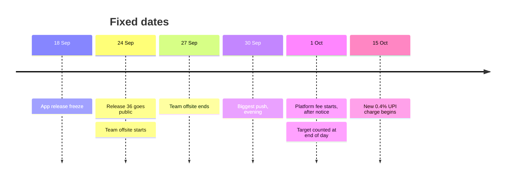

# Autopay in pictures

These diagrams draw `feature-map.md`. If a diagram and the map disagree, the map wins: fix the diagram in the same pull request as the map change. GitHub draws them on its own. The published interactive page uses the same diagrams, copied from this file.

Rule numbers such as R46 point to `decisions/decision-log.md`.

## 1. A tenant's journey

## 2. Every state an Autopay can be in

Counts toward the target: On, Pause requested, Failed (still active), Needs new approval, Ending soon. Does not count: Paused, Ended, Cancelled, Not set up, Started, Waiting for bank approval.

## 3a. One debit, Option 2 (all dues, on demand)

## 3b. One debit, Option 1 (rent on a fixed schedule)

## 3c. A payment request for an extra bill (R47)

## 4. The three charges, and where money goes

## 5. A pause request (R48, R50)

## 6. The push to 1 Oct

