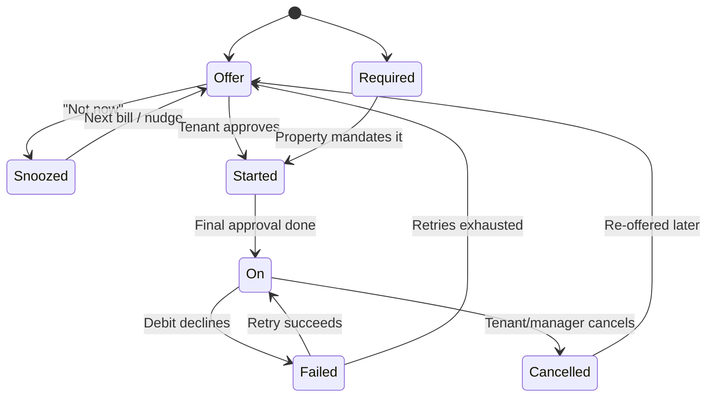

# Context Handoff — RentOk UPI Autopay Product Work

**Purpose of this file:** a complete, self-contained context transfer so another AI session (Claude, Claude Code, Codex, or any assistant) can pick up this work with zero loss of context. Attach this file as the first input to a new session, or paste it in.

**Generated:** 17 September 2026
**Source session:** Claude (Cowork), working with Kamal G (kg@eazyapp.tech), RentOk
**Live deliverable:** https://claude.ai/code/artifact/a9e66403-1f6b-4929-bb14-8961ba462f5c

---

## 0. How to resume (read this first)

You are picking up mid-stream on a product management workstream at RentOk (Indian rental / PG-and-co-living property management SaaS; tenant app + manager app + payment links at pay.rentok.com). The human is **Kamal**, a product manager there.

The work: **redesign RentOk's UPI Autopay mandate experience and plan its rollout to the full customer base before NPCI's new UPI MDR framework takes effect on 15 October 2026.**

A full plan document already exists (reproduced verbatim in Appendix A). Your job on resume is most likely one of:
- Reviewing the two Figma links that could not be opened (rate-limited, see §6)
- Turning the plan into tickets / a PRD / a spec for engineering
- Pressure-testing the split-mandate workaround (§4.3) with the payment provider
- Iterating on copy, screens, or the adoption campaign

**Tone/working style Kamal responds well to:** direct, specific, opinionated. He supplies real artifacts (screenshots, screen recordings, Figma links) and expects them to actually be examined, not skimmed. He pushes back with his own product ideas (see §7) and expects those to be researched and integrated rather than praised. Numbers, named constraints, and concrete copy beat generic frameworks.

---

## 1. Who / what / why

| Field | Value |
| --- | --- |
| Company | RentOk (eazyapp.tech domain) |
| Product surface | Tenant mobile app + web check-in flow (rentok.com/checkin) + manager/owner app + payment links (pay.rentok.com) |
| Segment | Indian rentals, heavily PG / co-living / hostel (shared rooms, per-bed rent, meal menus, attendance, police verification) plus independent tenancies |
| Payment provider (PSP) | **Cashfree** (confirmed from the screen recording — api.cashfree.com/pg checkout observed mid-flow) |
| Person | Kamal, Product Manager |
| Current state | UPI Autopay is live for a **limited** set of properties/tenants and is, in Kamal's own words, "not built properly" |
| Goal | Scale UPI Autopay to all customers, with a redesigned flow + an adoption plan |
| Hard deadline | 15 Oct 2026 (NPCI MDR framework) |

---

## 2. What was asked, turn by turn

1. **Initial brief.** Kamal asked for a full product plan — UI/UX, product changes, marketing, adoption — for scaling UPI Autopay, structured explicitly as:
   - Section 1: UPI Autopay Mandate Setup → (1) Post Signup on Tenant App, (2) WhatsApp/Welcome message, (3) Changes in Rent Agreement/TnC, (4) Payment Link, (5) Manager App Changes
   - Section 2: Adoption
   He attached 2 screenshots of RentOk's current autopay flow, said he prefers CRED's flow, and asked for other apps to be benchmarked.
2. **Kamal's own idea.** He proposed handling >₹15,000 rents by **splitting the amount into 2–3 mandates** using on-demand/multiple-debit autopay, to stay under the silent-debit ceiling. This was researched and folded into the plan (see §4.3, §7).
3. **More evidence supplied.** A ~4.5 min screen recording (RentOk current flow + CRED flow walkthrough) plus two Figma links for a payment-page revamp, with a request to analyse both and produce the new flow "with UI/chart if possible."
4. **This file.** A portable context export for continuing elsewhere.

---

## 3. Deliverable produced

A living plan document (Claude Docs artifact) titled **"RentOk UPI AutoPay — Product Flow Redesign & Adoption Plan"**, at:
https://claude.ai/code/artifact/a9e66403-1f6b-4929-bb14-8961ba462f5c

Contents: Executive Summary → Current Flow Audit → Benchmark Study → Section 1 (1.1 post-signup, 1.2 WhatsApp, 1.3 Agreement/T&C, 1.4 Payment link, 1.5 Manager app, 1.6 CRED pattern + Figma cross-check) → Section 2 Adoption → Metrics/Risks/Open questions → Sources. Two Mermaid diagrams (setup flowchart, mandate state machine) are embedded.

**Full text is reproduced verbatim in Appendix A of this file.**

---

## 4. Hard research findings (the load-bearing facts)

These were verified against sources during the session. Anything a resuming agent should NOT have to re-derive.

### 4.1 The commercial "why now"

- NPCI's new UPI MDR framework takes effect **15 October 2026**: 0.4% MDR (capped ₹300) on person-to-merchant UPI payments **above ₹2,000**, borne by the merchant; merchants may not pass it to customers. Transactions ≤₹2,000 are free. Source: https://cajatinkarda.in/articles/upi-mdr-charges-october-2026
- **UPI Autopay mandates are explicitly zero-MDR** for recurring bills and subscriptions. Confirmed independently for SIPs, insurance premiums and OTT subscriptions: https://www.businesstoday.in/personal-finance/investment/story/upi-mdr-from-october-15-what-happens-to-auto-debit-payments-for-mutual-funds-insurance-and-ott-subscriptions-555732-2026-09-15
- **Therefore:** rent collected via one-time Collect requests / payment links / QR (nearly always >₹2,000) starts costing RentOk 0.4% from 15 Oct, while the same rent collected via an Autopay mandate costs nothing. This is the core business case for the whole initiative — and it corrects the common misreading that "UPI charges" make autopay more expensive; the opposite is true.

### 4.2 The structural constraint — the ₹15,000 AFA ceiling

- UPI Autopay debits execute **silently (no UPI PIN) only up to ₹15,000 per transaction**. Above that, RBI's e-mandate rules require Additional Factor of Authentication (UPI PIN) on **every single debit**.
- The AFA-free threshold was raised to **₹1,00,000 effective 14 Dec 2023 (RBI/2023-2024/88)** but **only for specific merchant categories**: mutual fund subscriptions, insurance premiums, credit card bill payments. Sources: https://taxguru.in/rbi/enhancement-limits-upi-autopay.html and https://paytm.com/blog/bill-payments/upi-autopay/upi-autopay-maximum-limit-complete-guide-2025/
- **Rent is not on the exempt list.** So for any rent above ₹15,000, "autopay" is not silent — the tenant taps a PIN every cycle.
- This is almost certainly **why CRED built RentPay on the credit-card rail rather than UPI Autopay** — card mandates carry no such ceiling, plus it monetises via interchange and rewards tenants with interest-free float and CRED coins. Source: https://cred.club/articles/pay-rent-with-cred
- **Segment nuance discovered from the recording:** RentOk's PG/co-living properties often have per-bed rent at or under ₹12,000–15,000, i.e. *below* the ceiling, while independent-house tenants sit above it. Messaging should segment by property type, not treat all tenants identically.

### 4.3 Kamal's split-mandate idea (researched, unresolved)

Kamal proposed registering **2–3 separate mandates** (e.g. ₹12,000 + ₹12,000 + ₹6,000 for a ₹30,000 rent), each individually under ₹15,000 and therefore silent.

- **Technically coherent:** the AFA threshold applies per mandate execution, not to a payer's aggregate monthly debits to one merchant.
- **Precedent exists:** fintechs used this pattern for high-ticket SIPs and insurance premiums before the Dec 2023 category exemption raised their ceiling.
- **No source was found that explicitly permits or prohibits it.** Searches across NPCI/PSP documentation (Razorpay, Cashfree, Decentro, PayU, Paytm) returned nothing on splitting to stay under the AFA threshold.
- **Open risks to validate with Cashfree/bank:** multiple mandate registrations at signup (friction), reconciling 2–3 debits against one rent invoice, and whether a bank risk team reads it as split-transaction structuring.
- **Status: unresolved — needs a technical spike with Cashfree.** If it clears, it likely becomes the default path for high-value rents and removes the biggest structural constraint in the plan.

### 4.4 Compliance / operational rules that shape the design

- **24-hour pre-debit notification is mandatory** before every scheduled debit (amount, date, mandate reference). Source: https://razorpay.com/blog/master-recurring-payments-upi-autopay-guide/
- Retry policy: one original attempt + a maximum of **3 retries** within the regulatory window; smart timing (e.g. post-salary) recovers 15–20% of failures.
- Mandates must be pausable/revocable/modifiable by the customer at any time **from their own UPI app**, not just the merchant app.
- **UPI Autopay failure rates run 8–15%, versus 2–3% for card mandates** — failure handling is a first-class flow, not an edge case. Source: https://productgrowth.in/insights/fintech/upi-autopay-guide/
- RBI-flagged UX failures in autopay generally: users unaware they authorised a recurring mandate; mandates hidden with no unified view; silent failures; missing pre/post-debit notifications; cancellation harder than signup. Source: https://medium.com/@designstudiouiux/upi-autopay-mandate-the-ux-flaw-rbi-caught-b44cdb6b4b2a
- UX levers with measured impact: pre-selecting the user's primary bank/UPI app (+20–30% completion); plain-language authorisation copy instead of "mandate"; showing exact future debit dates.

---

## 5. Evidence from the inputs Kamal supplied

### 5.1 Screenshots — RentOk's current autopay setup (check-in step 3 of 5)

Two screens: an "Autopay details" summary page and a "Select Autopay Date" modal. Observed facts:
- Modal copy reads **"Choose a date between 1st – 1st"** with every date except the 1st greyed out — reads as a bug, not a deliberate default.
- Summary shows: Valid from 17 Sep'26 · **Valid till "Until eviction"** · Monthly Rent ₹12,000 · Autopay Fee ~~₹50~~ **₹0** one-time · Setup Fee ~~₹50~~ **₹0** one-time · Total ₹12,000/monthly.
- CTA reads **"Schedule Rent Payment"** — the word "autopay" never appears before commitment.
- Trust microcopy "We never store your UPI PIN or bank password" sits low on the page, sole trust signal.
- Escape hatch is "Wrong details? Contact admin" (WhatsApp) — no self-serve edit.
- Autopay setup (step 3) happens **before** the Rental Agreement (step 4).

### 5.2 Screen recording — RentOk half (approx. first 3 minutes)

Walkthrough of the tenant check-in and payment journey. Observed:
- Check-in steps: Property Details → Tenant Verification (Aadhaar upload, selfie required) → Setup Payment → Rental Agreement → Move-In Checklist.
- On "Schedule Rent Payment" the button goes to a **"Setting up…"** state, then redirects to **api.cashfree.com/pg** — Cashfree-hosted checkout branded "EAZYAPP", offering **UPI** and **Bank Account** as payment options (test amount ₹1).
- Post-check-in app home: "Hello, Kamal Test", My Accounts tiles (Pay dues to get credits · **Total Dues ₹79,755** · Rent ₹12,000), Express Check-In promo, "Life in Property" (Facing Issues, Attendance), Thursday's Menu (breakfast/lunch) — confirming the PG/co-living context — and Profile Status tiles (Profile complete, Police verification pending).
- **Payment Options screen** (the manual pay-dues path) offers: Pay with UPI (GPay, PhonePe, Paytm, Show all apps), Pay with Cash (OTP, collected by authorised staff), Online Modes (Enter UPI ID / VPA, Pay with Cards), plus a **"RentPass Cashback"** line item (a loyalty currency that already exists in the product).
- **Critical gap:** there is **no autopay entry point anywhere on that Payment Options screen** — no banner, no checkbox, nothing. Every manual payment today is a missed upsell.
- Profile shows "My Rental Agreement — Sign your rental agreement now" still pending *after* the tenant is active, reinforcing the sequencing problem (mandate authorised before the agreement that should govern it).

### 5.3 Screen recording — CRED half (approx. last 90 seconds)

This is the pattern Kamal wants copied. Observed in CRED's credit-card bill payment flow:
- Home: gamified rewards ("Coin Rush", freebies worth ₹500 CR, credit offer, wallet), Upcoming Bills list (ICICI, SBI) with Pay buttons.
- Card detail: "DUE IN 6 DAYS · ₹8,013.88 · Pay now", spends summary, statement period.
- Bill payment sheet: **pay total due / pay minimum due / pay other amount** radio options, "100% late fee protection" reassurance, "Check bank balance" link, "Pay instantly →".
- Discount applied inline: "PAYING TOTAL DUE ₹8,009.88 ~~₹8,013.88~~ · saving ₹4 from CRED balance · remove".
- Bank picker with per-bank trust badges: "NEW ENHANCED LIMIT: ₹2,00,000" / "₹5,00,000".
- **The key finding:** immediately above the final "Pay now" button sits a single line with a plain checkbox — **"pay future bills with autopay — cancel, pause & edit anytime · know more"**. That is CRED's entire autopay opt-in. No separate flow, no multi-screen journey, cancellation rights stated inline at the moment of consent.

### 5.4 Figma — "Autopay — every state and surface" (file 4eP9PIjrNVhGmGLiqADN7D, node 2:2)

Retrieved as structured metadata (screenshots were rate-limited before they could be pulled — see §6). This file is RentOk Design's own WIP spec and it is **substantially aligned with the plan in Appendix A**. Frame inventory, verbatim:

**The card's views**
- `1:17` — 01 · Offer — on a bill she owes
- `1:2` — 02 · Offer — nothing to pay
- `1:3` — 03 · Snoozed — after Not now
- `1:4` — 04 · Required by the property
- `1:5` — 05 · Started — one approval left
- `1:6` — 06 · On — pays itself on the 5th
- `1:7` — 07 · Failed — didn't go through

**Where it arrives**
- `1:13` — 13 · The moment sheet
- `1:14` — 14 · The day grid — 31 days
- `1:15` — 15 · The dock above Pay all
- `1:10` — 10 · After paying — the moment

**Elsewhere on the page**
- `1:8` — 08 · The covered row on the paper
- `1:9` — 09 · Due detail — autopay takes this one
- `1:16` — 16 · Due detail — the autopay panel
- `1:11` — 11 · Property sheet — autopay highlighted
- `1:12` — 12 · No day known yet

**The file's own annotation, verbatim (important — it reveals the engineering status):**
> "Rendered from a real bill on 14 Sep 2026, at 390px. No tenant can see any of this yet: not one autopay field is in the payload (rentok-backend#6829 item 6), and CAN_SET_UP is false in autopay.js — the approve key is a preview until rentok-backend#6816 lands. Snoozed is stored in the browser, not the URL, so it previews identically to Offer."

Implications already captured in the plan: the 31-day day grid fixes the "1st only" bug; the dock above "Pay all" fixes the missing entry point found in §5.2; the lifecycle states map to the state machine in Appendix A §1.6; and **the whole thing is blocked on rentok-backend#6829 and #6816**, which is a Phase 0 dependency against the 15 Oct deadline.

### 5.5 Figma — "Payment Page Revamp — pay.rentok.com" (node 5:28) — NOT REVIEWED

Kamal shared https://www.figma.com/design/4eP9PIjrNVhGmGLiqADN7D/Payment-Page-Revamp-%E2%80%94-pay.rentok.com?node-id=5-28 . The node is 2616×5700px (a tall stack of screens). **It was never reviewed** — the Figma connection hit its seat rate limit first. This is an open item; Section 1.4 of the plan (Payment Link Flow) is therefore written from first principles and has **not** been reconciled against the actual redesign.

---

## 6. Environment & tooling constraints hit (so you don't repeat them)

1. **Figma MCP rate limit.** Kamal's Figma account is a **View seat on the Professional plan**, which allows only a handful of MCP tool calls. After ~4 successful calls (2 screenshots, 1 metadata fetch, 1 frame screenshot) every subsequent call returned: *"You've reached the Figma MCP tool call limit for your View seat on the Professional plan."* Plan Figma calls sparingly: fetch `get_metadata` first (cheap, high information), then spend remaining calls on the 2–3 frames that actually matter.
2. **Figma asset URLs are not fetchable from the sandbox.** `get_screenshot` returns a short-lived `figma.com/api/mcp/asset/...` URL, but direct HTTP to figma.com is blocked by the egress policy (403 on CONNECT). Use `enableBase64Response: true` on `get_screenshot` if you actually need to see pixels.
3. **No audio transcription available.** The screen recording has narration, but Hugging Face is blocked by the egress proxy, so no Whisper model could be downloaded. **All video findings in §5.2/§5.3 are from visual frame analysis only** — Kamal's spoken commentary has never been captured. Worth asking him to summarise it, or re-running transcription in an environment with model access.
4. **Video frame extraction that worked:** `ffmpeg -i video.mp4 -vf "select='gt(scene,0.28)'" -vsync vfr frame_%03d.png` produced 28 usable distinct screens from 4m23s. A threshold of 0.12 over-triggered (66 frames).

---

## 7. Decisions made, and what is still open

**Settled during the session:**
- Autopay is the *cheaper* rail post-15 Oct, not the more expensive one — this frames the whole business case.
- Tenants must never be told about MDR as a reason to switch; the tenant-facing pitch is "never miss a due date, never get a late fee, nothing to remember."
- The plan explicitly designs for both the ≤₹15,000 (silent) and >₹15,000 (one-tap approval) cases rather than overpromising "fully automatic."
- Autopay consent belongs in the Rental Agreement step, not before it.
- Incentives should run through the **existing RentPass Cashback** mechanic rather than a new currency.

**Open questions (also in the doc's checklist):**
- [ ] Is the ₹0 Autopay/Setup fee a permanent policy or a time-boxed promo?
- [ ] Should RentOk lobby NPCI/its bank for a rent category exemption (raising the silent ceiling to ₹1,00,000)? This would remove the single biggest constraint.
- [ ] Is 1st-of-month the only debit date by design, or a bug? (Figma's 31-day grid suggests Design assumes real dates.)
- [x] CRED reference — answered by the recording (single-checkbox opt-in).
- [ ] **Can Cashfree confirm the 2–3 split-mandate approach is supported and compliant?** Highest-value unknown.
- [ ] Timeline on rentok-backend#6829 and #6816 versus the 15 Oct deadline.
- [ ] Review of the Payment Page Revamp Figma screens (§5.5).

**Note on one doc edit:** risk item 3 in the plan ("Compliance gap if the 24-hr pre-debit notice isn't live…") currently has a Figma URL hyperlinked onto its text. It looks like an accidental paste during editing — worth removing.

---

## 8. Suggested next actions for a resuming session

1. Ask Kamal for exported images/PDF of the Payment Page Revamp frames (or a Figma seat upgrade) and reconcile plan §1.4 against them.
2. Ask him what the narration in the recording said — it has never been captured.
3. Draft the Cashfree spike brief for the split-mandate question (§4.3) — that answer changes the default flow for high-value rents.
4. Convert Appendix A §1.1–1.6 into engineering tickets, sequenced against rentok-backend#6829/#6816.
5. Draft the actual WhatsApp template copy for Meta template approval (templates need pre-approval; the 24-hr pre-debit notice is compliance-critical and should be submitted first).
6. Draft the Agreement/T&C clause language for Legal (plan §1.3 lists the six clauses needed).

---

## Appendix A — The plan document, verbatim

*(This is the full current text of https://claude.ai/code/artifact/a9e66403-1f6b-4929-bb14-8961ba462f5c as of 17 Sep 2026. If you have access to that link, prefer the live version — it may have moved on.)*

---

# RentOk UPI AutoPay — Product Flow Redesign & Adoption Plan

2026-09-17 · Prepared for @Kamal

## Executive Summary

NPCI's new UPI MDR framework takes effect **15 Oct 2026 — four weeks out** — and charges merchants 0.4% (capped at ₹300) on person-to-merchant UPI payments above ₹2,000, while **UPI Autopay mandates for recurring bills and subscriptions stay at zero MDR** ([source](https://cajatinkarda.in/articles/upi-mdr-charges-october-2026)). Almost every rent payment collected today through a one-time Collect request, payment link, or QR — RentOk's fallback for tenants without autopay — is well above ₹2,000. Once the rule lands, each of those becomes a 0.4% cost. Moving tenants onto UPI Autopay is therefore not a UX nicety, it's how RentOk keeps rent collection free to process.

Today autopay is live for a limited set of properties/tenants and, by your own read, isn't built well enough to push further: the setup flow (screenshots below) buries trust signals, gives no visibility into the mandate once it's live, and leans on manual nudges instead of a self-serve flow. Scaling to all customers before 15 Oct means fixing two things in parallel:

1. **The mandate setup flow** — signup moment, WhatsApp messaging, agreement/TnC language, payment-link fallback, and manager-app visibility (Section 1).
2. **Adoption** — converting the existing non-autopay base and making autopay the default for every new tenant (Section 2).

The rest of this document works through both, benchmarked against CRED (which runs its own rent-payment product) and other UPI Autopay implementations.

## Current Flow Audit

From the attached screenshots (Setup Payment, step 3 of 5, on the check-in flow): the mandate itself works, but the screen doesn't do the job of a mandate-consent screen — it reads like a bill-pay confirmation.

| Moment | What the tenant sees today | Gap |
| --- | --- | --- |
| Date picker | "Choose a date between 1st – 1st", every other date greyed out | Copy promises a range but there's only one option — reads like a bug, not a deliberate default. If 1st-only is intentional, say so; if not, this is the single highest-leverage fix. |
| Mandate duration | "Valid till: Until eviction" | Legally correct, but no mechanism on-screen to end it earlier — exactly the "easy to start, hard to stop" pattern RBI flagged in UPI Autopay flows generally. |
| Fee framing | "₹50 → ₹0" struck through for Autopay Fee and Setup Fee | Reads as a discount, not a policy — doesn't say if ₹0 is permanent, promotional, or reversible. Ambiguity here undercuts trust more than a plainly-stated fee would. |
| Consent clarity | CTA says "Schedule Rent Payment" | Doesn't say "autopay", "mandate", or "recurring" — the exact ambiguity RBI called out: tenants not realizing they authorized a standing instruction, not a one-time payment. |
| Mandate visibility | Nothing after setup | No calendar of upcoming debits, no in-app mandate status, no pause/cancel entry point once live — tenant's only lever is "Contact admin" over WhatsApp. |
| Sequencing | Autopay setup is step 3 of 5, *before* step 4 "Rental Agreement" | Tenant authorizes a recurring debit before the legal agreement (which should carry the autopay consent clause) is even shown. |
| Trust microcopy | "We never store your UPI PIN or bank password" | Good instinct, but it's the only trust signal on the page, placed low, and not reinforced anywhere else in the journey (WhatsApp, agreement, confirmation). |

**Confirmed by walking the flow recording you sent:** the live Payment Options screen (UPI apps, cash, cards) that tenants see when paying dues manually has no autopay entry point at all — no banner, no checkbox, nothing. Every manual payment today is a missed upsell moment (the fix is already spec'd in Figma — see Section 1.6). The recording also confirms RentOk's PSP is **Cashfree**, and that several properties run as PG/co-living (shared rooms, per-bed rent, in-app meal menus) where monthly rent often sits at or under ₹12,000–15,000 — much closer to the silent-autopay ceiling than an independent-house tenant. Worth segmenting the >₹15,000 messaging in Section 1.1 by property type rather than treating all tenants the same.

The redesign in Section 1 fixes these in place rather than replacing the flow — same steps, same step-counter position, tightened copy and added visibility.

## Benchmark Study

The pattern worth copying from CRED isn't a screen — it's a constraint it designed around. **UPI Autopay mandates only debit silently, without a UPI PIN, up to ₹15,000 per transaction**; above that, RBI's e-mandate rules require PIN authentication (Additional Factor of Authentication) on every single debit, unless the merchant category is one of the few NPCI has exempted (mutual funds, insurance, credit-card bills, up to ₹1,00,000) ([source](https://taxguru.in/rbi/enhancement-limits-upi-autopay.html), [source](https://paytm.com/blog/bill-payments/upi-autopay/upi-autopay-maximum-limit-complete-guide-2025/)). Rent is **not** on that exempt list. That's almost certainly why CRED built RentPay on the credit-card rail instead of UPI Autopay — card mandates don't carry the ₹15,000 ceiling, and it lets CRED monetize via card interchange plus reward tenants with interest-free float and CRED coins ([source](https://cred.club/articles/pay-rent-with-cred)).

| Product | Rail | How it handles the mandate ceiling | Setup UX pattern | Lifecycle visibility |
| --- | --- | --- | --- | --- |
| CRED RentPay | Credit card, not UPI | N/A — card mandates aren't capped | 7 taps: amount → card → landlord bank/UPI → address confirm → pay; autopay offered as a toggle after the first successful payment | SMS + email receipt every cycle; one rent payment per calendar month enforced, so no duplicate-debit confusion |
| Standard UPI Autopay (Google Pay / PhonePe rails, e.g. subscriptions) | UPI | Silent only ≤₹15,000; above that, PIN every cycle | Bank pre-selected by default (opt to change); plain-language authorization line ("Authorize automatic ₹X monthly"), not "mandate"; 3-step progress bar | Mandatory 24–48 hr pre-debit notification; mandate can be paused/cancelled from *either* the merchant app or the UPI app itself |
| NoBroker Pay / Housing.com rent apps | UPI + cards | Same ₹15,000 constraint, largely unaddressed publicly | Rent-specific reminders and split-payment options; autopay is offered but not the default path | Standard UPI app-level mandate management, nothing rent-specific |
| RentOk today | UPI only | Not addressed — flow doesn't disclose the ceiling or what happens above it | See audit above | None post-setup |

**Implication for RentOk:** most metro rents (₹15,000–₹50,000+) sit above the silent-debit ceiling. Section 1 below designs for both cases explicitly — true one-tap-free autopay under ₹15,000, and a fast "approve this month's debit" push notification flow above it — rather than promising "fully automatic" and quietly breaking that promise for the majority of tenants who pay more than ₹15,000. Worth deciding deliberately whether to also pursue an NPCI category exemption for rent (insurance and mutual funds got one; there's a case rent collection deserves the same) — flagged as an open question in Section 2.

**Alternative worth testing: split the mandate, not the debit.** Instead of one ₹30,000 mandate needing a PIN each cycle, register 2–3 separate UPI Autopay mandates against the same tenant (e.g. ₹12,000 + ₹12,000 + ₹6,000), each individually under ₹15,000 and therefore silent. Some fintechs used exactly this pattern for high-ticket SIPs and insurance premiums before NPCI raised the exempt-category ceiling to ₹1,00,000 in Dec 2023 — the AFA threshold applies per mandate execution, not to a payer's total monthly debits to one merchant. It needs validation with RentOk's PSP/bank before committing (multiple mandate registrations at signup, reconciling 2–3 line items against one rent invoice, and confirming the bank doesn't flag it as split-transaction structuring) — but if it clears compliance review, it's a stronger default than the 1-tap-approval flow below: true "set and forget" for every rent amount, not just those under ₹15,000.

## 1. UPI Autopay Mandate Setup

### 1.1 Post-Signup on Tenant App

```mermaid
flowchart TD
    A[Tenant completes signup /<br/>check-in] --> B["Set up Autopay"<br/>full-screen prompt, not a modal]
    B --> C{Rent amount<br/>vs ₹15,000}
    C -->|≤ ₹15,000| D["Fully silent — no PIN,<br/>no action needed each month"]
    C -->|> ₹15,000| E["1-tap approval each cycle —<br/>we'll alert you 48 hrs before"]
    D --> F[Mandate summary card:<br/>amount, frequency, next 3 dates]
    E --> F
    F --> G[Pick debit date<br/>real choice, not forced to 1st]
    G --> H[Primary UPI app pre-selected,<br/>"change" link visible]
    H --> I[Redirect to UPI app →<br/>mandate authorization]
    I --> J[Success screen:<br/>12-month calendar + Pause/Cancel button]
    B -.->|Skip| K[Reminder resurfaces at<br/>next rent due − 3 days]
```

Specific changes from today's flow:

1. **Fix the date picker bug first.** "Choose a date between 1st – 1st" with everything but the 1st greyed out either ships as a real date-range picker (align to each tenant's actual due date) or the copy changes to state the policy plainly: "Rent is auto-debited on the 1st of every month." Never ship copy that promises a choice that isn't there.
2. **Segment by amount, say so on-screen.** Per the benchmark, ≪₹15,000 mandates are truly silent; above that, RBI requires a UPI-PIN tap every cycle. Tell tenants which bucket they're in up front ("no action needed" vs "1-tap approval") rather than promising "fully automatic" for everyone and breaking that promise silently for the majority of tenants paying more than ₹15,000.
3. **Rename the CTA.** "Schedule Rent Payment" → "Set Up Autopay" / "Authorize Autopay Mandate" — the word "autopay" must appear before the tenant commits, directly addressing the RBI-flagged awareness gap.
4. **Add a mandate summary card** before the UPI redirect: amount, frequency, and the *next three* debit dates written out ("₹12,000 on 1 Oct, 1 Nov, 1 Dec"), not just "starting from". This is the single highest-trust element in the CRED and productgrowth.in patterns.
5. **Pre-select the tenant's primary UPI app** (inferred from their registered VPA or most-used app) with a visible "change" option — this alone lifts completion 20–30% per UX benchmarks on bank/app pre-selection.
6. **Success screen gets a calendar + a Pause/Cancel button**, not just a toast. This is the RBI-mandated parity: cancelling should be as easy as setting up.
7. **Never make setup blocking.** A "Skip for now" option keeps the tenant in the check-in flow; the ask resurfaces via WhatsApp 3 days before the next rent due date (Section 1.2), not as a nag on every app open.

**If the split-mandate path above is validated:** step 2 becomes a three-way split by amount, not two-way — under ₹15,000 stays on one fully silent mandate; above it, the tenant registers 2–3 smaller mandates in the same setup flow ("We'll set this up as {n} smaller monthly payments totalling ₹{amount} so it can debit automatically") instead of committing to a recurring 1-tap approval. Worth a quick technical spike with the PSP before locking the flow — see the open question below.

### 1.2 WhatsApp Welcome & Nudge Messaging

WhatsApp is RentOk's highest-leverage adoption channel — tenants already expect rent reminders there. NPCI's e-mandate rules make one message mandatory (a pre-debit alert) and the rest is where adoption is actually won or lost.

| Trigger | Message | CTA button |
| --- | --- | --- |
| Day 0 (signup, no mandate yet) | "Welcome to RentOk! Set up Autopay once and never worry about a late rent payment again. Takes 30 seconds." | "Set Up Autopay" → deep-links straight to the mandate screen |
| T−7 days (rent due, no mandate) | "Your rent of ₹{amount} is due on {date}. Set up Autopay now so you never have to remember again." | "Set Up Autopay" |
| T−48 hrs (mandate exists, upcoming debit) | "Heads up: ₹{amount} will be auto-debited on {date} for {property}. Make sure your account has sufficient balance." | "View Details" |
| T−24 hrs (mandatory NPCI pre-debit notice) | "Reminder: ₹{amount} autopay debit scheduled for tomorrow, {date}." | none needed — informational, required by NPCI |
| For >₹15,000 mandates: T−24 hrs approval ask | "Your ₹{amount} rent debit is scheduled for {date}. Tap to approve — takes one tap." | "Approve Now" → opens UPI app pre-filled |
| Day-of, on success | "✅ ₹{amount} rent paid via Autopay for {property}. Receipt attached." | "View Receipt" |
| Day-of, on failure | "⚠️ Your ₹{amount} autopay debit failed (low balance / bank declined). We'll retry in 24 hrs. Want to pay manually now?" | "Pay Now" |
| Day +7, still not on Autopay | "You've paid rent manually 3 months running — Autopay would've saved you {X} reminders. Set it up now." | "Set Up Autopay" |

Implementation notes:

- Use WhatsApp Business API **template messages with quick-reply / call-to-action buttons** deep-linking into the RentOk app's mandate screen — don't make the tenant search for the feature.
- The T−24 hr pre-debit alert is not optional — it's the NPCI-mandated notification; missing it is a compliance gap RentOk should close even before scaling adoption ([source](https://razorpay.com/blog/master-recurring-payments-upi-autopay-guide/)).
- Cap nudge frequency to avoid opt-outs: one welcome, one pre-due reminder, mandatory pre-debit and post-debit messages, and a monthly "still not on Autopay" nudge — not a message every single day.

### 1.3 Rent Agreement & T&C Changes

Today's flow sets up the mandate in step 3 and shows the Rental Agreement in step 4 — the tenant authorizes a recurring debit before seeing the legal terms that should govern it. Two fixes, one sequencing and one content:

**Sequencing:** move the autopay consent clause into the Rental Agreement step itself (or duplicate it there), so the agreement the tenant signs is the record of consent — not a separate, earlier tap that isn't tied to any document.

**Clauses to add or tighten in the Agreement / T&C:**

1. **Explicit mandate clause** — "By enabling Autopay, you authorize RentOk to initiate a recurring UPI debit of ₹{amount} on {date} of every month from your registered UPI ID, until you cancel it or your tenancy ends." Plain language, no "standing instruction" jargon without a plain-English restatement.
2. **Cancellation rights** — state explicitly that the mandate can be paused or cancelled anytime from the RentOk app or the tenant's own UPI app, with no notice period and no penalty, mirroring RBI's parity requirement between signup and cancellation.
3. **NPCI charge disclosure** — add a line clarifying that UPI Autopay debits carry no transaction fee to the tenant (mandates are zero-MDR under NPCI's Oct 2026 framework); this pre-empts confusion if tenants later see MDR headlines and wonder if their rent got more expensive.
4. **Failure & retry disclosure** — state the retry policy (attempt + up to 3 retries within the regulatory window) and what happens if all retries fail (manual payment required, any late-fee policy applied only after this window).
5. **Data handling line**, reused from the current "we never store your UPI PIN" microcopy — promote it from a footnote into an actual T&C clause so it's enforceable, not just reassuring.
6. **>₹15,000 mandates** — add a line clarifying that RBI rules require a one-tap approval each cycle above this threshold, so tenants don't read a failed silent debit as a bug.

Ownership: Legal/Compliance drafts final clause language; Product confirms the clause text renders inside the in-app agreement viewer (not just a PDF attachment) so it can be highlighted at the moment of signing.

### 1.4 Payment Link Flow

Payment links matter because they're the path for tenants who haven't installed the app — exactly the segment most exposed to the new 0.4% MDR on one-time UPI payments above ₹2,000. Today a link almost certainly ends the journey at "payment successful." It should end at an autopay offer instead.

```mermaid
flowchart LR
    A[Tenant opens payment link<br/>via WhatsApp/SMS] --> B[One-time payment screen<br/>amount pre-filled]
    B --> C[Payment completes]
    C --> D["Never pay manually again"<br/>banner on success screen]
    D --> E{Device}
    E -->|Mobile, UPI app installed| F[UPI Intent flow —<br/>mandate authorized in-app, 2 taps]
    E -->|Desktop / no UPI app| G[UPI Collect flow —<br/>enter VPA, approve in own UPI app]
    F --> H[Mandate created,<br/>confirmation + "download RentOk app" nudge]
    G --> H
```

Key decisions:

1. **Offer autopay on the success screen, not before payment.** The tenant has just proven intent to pay — this is the highest-conversion moment, matching the pattern of nudging right after a completed action rather than before it.
2. **Detect device type and switch flow accordingly.** UPI Intent (redirect to a UPI app) only works on the same mobile device; a desktop or SMS-opened link needs the Collect flow (tenant enters their VPA, then approves the mandate inside their own UPI app) — don't show an Intent button that silently fails on desktop.
3. **No app install required to set up the mandate itself** — keep app installation as a separate, secondary nudge after the mandate exists, so autopay conversion isn't gated behind a download.
4. **Track repeat manual payers.** A tenant who pays via link 2+ months running should get the WhatsApp Day+7 nudge (Section 1.2) and, on their next link open, a slightly more assertive banner ("You've paid manually 3 times — set up Autopay in 30 seconds").

### 1.5 Manager/Owner App Changes

Managers are the ones fielding "why didn't my rent come in" today — the manager app needs to answer that before they have to ask the tenant.

| Feature | What it does | Why |
| --- | --- | --- |
| Mandate status column | Every tenant row shows: No Mandate / Active / Paused / Failed — not just "Paid / Unpaid" | Managers currently can't tell *why* rent didn't land; this closes that gap without a support ticket |
| Bulk nudge | Select all "No Mandate" tenants in a property → send the WhatsApp autopay-setup template in one tap | Turns adoption into a manager-driven campaign, not just a tenant-side nudge |
| Failure alerts | Push + in-app alert to the manager the moment a scheduled debit fails, with the reason (low balance / bank declined / mandate revoked) | Lets managers follow up same-day instead of finding out at month-end reconciliation |
| Portfolio autopay rate | Dashboard tile: % of tenants on Autopay, trended monthly, per property and portfolio-wide | Gives managers (and RentOk) a number to manage adoption against, not just anecdote |
| Override / exception tools | Manager can adjust a specific tenant's debit date or pause a mandate on request (e.g. dispute, move-out in progress) without going through support | Reduces support load, keeps managers self-serve |
| Agreement clause preview | When generating a rental agreement, manager sees the autopay consent clause (Section 1.3) inline and can confirm it's included before sending for signature | Makes the legal fix in 1.3 operational, not just a policy change |

This is also where the MDR argument becomes concrete for managers: a portfolio autopay-rate tile can be paired with an estimated "transaction fees avoided this month" figure once the Oct 2026 MDR rule is live, giving managers (who influence their tenants directly) a reason to push adoption themselves.

### 1.6 Cross-Check: The CRED Pattern Worth Copying Directly + What Design Has Already Spec'd

**From the recording: CRED's actual autopay opt-in is a single checkbox on an existing payment screen, not a separate flow.** On a routine one-time credit-card bill payment, right above "Pay Now," CRED shows one line — "pay future bills with autopay — cancel, pause & edit anytime · know more" — with a plain checkbox. No extra screens, no re-explaining the mandate elsewhere. That's a stronger pattern than a dedicated multi-step setup flow for one specific case: **a tenant already on a manual payment screen** (the payment-link flow in Section 1.4, or a returning tenant paying dues manually in-app). Add this exact checkbox to those screens as a second, lower-friction entry point alongside the dedicated setup flow in Section 1.1 — don't route every tenant through a multi-screen journey when they're already mid-payment.

**Design has already spec'd the fix for the missing entry point above.** The "Autopay — every state and surface" Figma file lays out 16 frames covering this and more — lifecycle states (Offer, Snoozed after "Not now," Required by the property, Started with one approval left, On and paying itself on a real due date, Failed) across every surface that matters: a moment sheet, a 31-day day grid (fixing the 1st-only date bug directly), a dock placed above "Pay all" (closing the missing-entry-point gap above), the after-paying confirmation moment, the receipt/statement view, due-item detail, and a property-level sheet for managers. It already matches nearly everything recommended in Sections 1.1–1.5.



Two things worth flagging back to Design/Engineering:

- The file's own note says none of this is live yet — "not one autopay field is in the payload" and the approve flow is gated behind two backend tickets (rentok-backend#6829, #6816). **That's a Phase 0 dependency** (Section 2) that needs a ship date against the 15 Oct MDR deadline, not just a design sign-off.
- The second Figma link you sent (Payment Page Revamp, pay.rentok.com) couldn't be reviewed in this pass — the Figma connection hit its view-seat rate limit right after pulling the autopay spec above. Worth either re-sharing those screens directly (export or screenshot) or upgrading that seat so Section 1.4 can be checked against the actual redesign.

## 2. Adoption

The MDR deadline (15 Oct 2026) forces a phased but fast rollout — fix compliance and the flow first, then push hard on migration.

| Phase | Window | Actions | Target |
| --- | --- | --- | --- |
| 0 — Fix & comply | Now – 15 Oct 2026 | Ship redesigned setup flow (Section 1.1), add the mandatory 24-hr pre-debit WhatsApp notice, update Agreement/T&C clauses, add manager mandate-status column | Every *existing* autopay-enabled tenant on the new flow; zero compliance gaps before the MDR rule lands |
| 1 — Default-on for new tenants | Oct – Nov 2026 | Autopay setup becomes the default step in check-in (not opt-in-buried); payment-link autopay upsell (1.4) live; manager bulk-nudge tool live | 100% of new signups see the autopay prompt; ≥70% completion at signup |
| 2 — Migrate the existing base | Nov 2026 – Jan 2027 | WhatsApp migration campaign to every manual payer (Section 1.2 sequence); manager-led portfolio pushes using the adoption-rate dashboard; permanently waive Autopay/Setup fees (already piloted at ₹0 per the current screens — make it official policy, not a silent promo) | 50% of the existing manual-pay base converted within 90 days |
| 3 — Sustain & optimize | Ongoing | Monitor failure/retry rates by bank; A/B test WhatsApp copy and nudge timing; monthly "fees avoided" reporting to ownership/managers | ≥85% portfolio-wide autopay adoption by mid-2027; failed-debit rate trending down quarter over quarter |

**Incentives worth testing (not yet committed — flagged for a call):**

1. **Permanent zero fee, framed as a policy** — "Autopay is free, forever" beats a struck-through discount that reads as temporary.
2. **On-time streak recognition** — a simple in-app badge or note ("6 months on time via Autopay") tenants can show landlords/managers; costs nothing, reinforces the habit.
3. **Referral nudge** — tenants who set up Autopay are asked to nudge flatmates/co-tenants on the same property, since adoption is naturally social within a shared unit.
4. **Manager incentive, not just tenant incentive** — since managers influence tenants directly and the manager app is the one asking for bulk nudges, consider a small operational credit or recognition ("top portfolio by autopay rate") tied to the adoption-rate dashboard in Section 1.5.
5. **Co-marketing with UPI apps** — Google Pay/PhonePe often promote merchants who drive autopay volume; worth a conversation once adoption numbers are meaningful.
6. **Pay incentives through RentPass Cashback, not a new currency** — the flow recording shows RentOk already runs a RentPass Cashback wallet in-app; award cashback for autopay activation and for on-time streaks through that existing mechanic instead of building a new one.

Messaging discipline throughout: never mention the MDR/NPCI charges to tenants as a reason to switch — that's an internal cost argument. To tenants, the pitch stays simple: never miss a due date, never get a late fee, nothing to remember.

## Success Metrics, Risks & Open Questions

### Metrics to track

| Metric | Why it matters |
| --- | --- |
| Mandate activation rate (at signup, and 30/60/90 days after) | Core adoption number the whole plan is judged on |
| Autopay success rate (debits succeeded / debits attempted) | Separates "tenants opted in" from "autopay actually works" — industry UPI Autopay failure rates run 8–15% vs 2–3% for cards, so this needs its own watch |
| Manual-vs-autopay MDR exposure (₹ saved/month) | Ties the whole initiative back to the business case in the Executive Summary |
| Support tickets re: rent payment | Should fall as mandate visibility (calendar, status, self-serve pause) improves |
| Mandate cancellation rate + reason | Distinguishes healthy churn (move-out) from flow-driven abandonment |

### Risks

1. **The >₹15,000 PIN-per-cycle reality undercuts the "fully automatic" pitch.** Most rents fall above this. If marketing overpromises "set and forget" without segmenting messaging (Section 1.1), tenants will perceive failed silent debits as bugs. Mitigate by being explicit about whichever path applies — 1-tap approval, or the split-mandate alternative if validated — everywhere: app, WhatsApp, agreement.
2. **UPI Autopay failure rates are structurally higher than cards.** Retry logic and pre-debit balance reminders (Section 1.2) reduce but don't eliminate this; budget for a visible "pay manually" fallback rather than treating failure as an edge case.
3. **Compliance gap if the 24-hr pre-debit notice isn't live before scaling.** This is an NPCI requirement, not a nice-to-have — sequence it in Phase 0, not alongside the marketing push.
4. **Sequencing fix in the Agreement (1.3) may need legal sign-off time.** Start that thread now given the Oct 15 deadline is four weeks out.

### Open questions

- [ ] Is the current ₹0 Autopay/Setup fee a permanent policy or a time-boxed promo? The redesign assumes it becomes a permanent, plainly-stated policy (Section 2).
- [ ] Worth pursuing an NPCI/bank conversation about a category exemption for rent (like insurance and mutual funds got, raising the silent-debit ceiling to ₹1,00,000)? This would remove the biggest structural constraint in this plan.
- [ ] Should the 1st-of-month date genuinely be the only debit date offered, or should tenants align it to their move-in/salary date? The Figma day-grid frame (Section 1.6) suggests Design already assumes a real date — worth confirming that's the direction.
- [x] CRED flow reference — answered: the recording you shared confirmed CRED's single-checkbox autopay opt-in pattern (Section 1.6).
- [ ] Can Cashfree (RentOk's PSP, confirmed from the recording) confirm that splitting a >₹15,000 rent into 2–3 sub-₹15,000 UPI Autopay mandates is supported and compliant? If yes, this likely replaces the 1-tap-approval flow as the default for high-value rents — worth a technical spike before locking Section 1.1.
- [ ] What's the timeline on rentok-backend#6829 and #6816 (the tickets gating the autopay payload/approve flow per the Figma file)? These need to land before 15 Oct for Phase 0 (Section 2) to hold.
- [ ] Can you re-share the Payment Page Revamp Figma screens (pay.rentok.com) directly — screenshots or a PDF export — so Section 1.4 can be checked against the actual redesign? The Figma connection hit its view-seat rate limit before this could be reviewed here.

## Sources

- [UPI Charges from 15 October 2026 — 0.4% MDR Explained](https://cajatinkarda.in/articles/upi-mdr-charges-october-2026)
- [Enhancement of Limits for UPI AutoPay — TaxGuru](https://taxguru.in/rbi/enhancement-limits-upi-autopay.html)
- [UPI AutoPay Limits & Rules 2026 — Paytm](https://paytm.com/blog/bill-payments/upi-autopay/upi-autopay-maximum-limit-complete-guide-2025/)
- [Pay Rent Online with CRED](https://cred.club/articles/pay-rent-with-cred)
- [Master Recurring Payments with UPI 2.0 Autopay: 2026 Guide — Razorpay](https://razorpay.com/blog/master-recurring-payments-upi-autopay-guide/)
- [UPI AutoPay: Design Guide for Recurring Payments — productgrowth.in](https://productgrowth.in/insights/fintech/upi-autopay-guide/)
- [UPI AutoPay Mandate: The UX Flaw RBI Caught — Medium](https://medium.com/@designstudiouiux/upi-autopay-mandate-the-ux-flaw-rbi-caught-b44cdb6b4b2a)
- [UPI MDR from October 15: auto-debit for mutual funds, insurance and OTT — Business Today](https://www.businesstoday.in/personal-finance/investment/story/upi-mdr-from-october-15-what-happens-to-auto-debit-payments-for-mutual-funds-insurance-and-ott-subscriptions-555732-2026-09-15)

---

*End of context handoff. Generated 17 Sep 2026 from a Claude (Cowork) session.*
