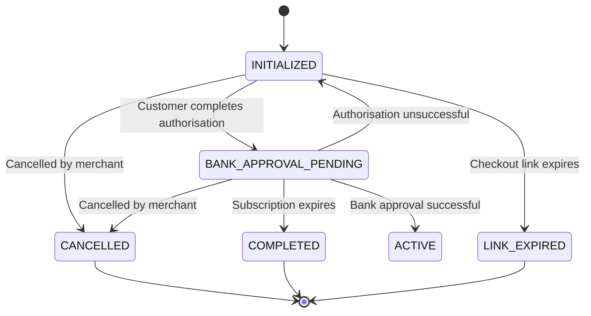

<!-- Captured 18 Sep 2026 from Cashfree's Subscriptions documentation (https://www.cashfree.com/docs/). Cashfree's live page is the authority. -->

> ## Documentation Index
> Fetch the complete documentation index at: https://www.cashfree.com/docs/llms.txt
> Use this file to discover all available pages before exploring further.

# Create a Subscription

> Create a Cashfree subscription, collect customer authorisation through the returned auth link, and activate recurring billing once the mandate is approved.

A subscription entity signifies the customer's commitment to make regular payments, showing they actively use the service and pay on a recurring basis. To register a subscription, first obtain the customer's authorisation. When you create a subscription, the response includes an authorisation link. Redirect the customer to this link to complete the authorisation process. Once the customer authorises, the subscription becomes active.

<Tabs>
  <Tab title="Dashboard">
    To create a new subscription from the dashboard, Go to `Subscriptions Dashboard > All Subscriptions > Create Subscription`. Follow the steps as shown in the below image.

    

    You can also create multiple subscriptions at once using the dashboard. Go to `Subscriptions Dashboard > Batch Subscriptions > Upload File` to upload a file that contains all the information required for multiple subscriptions.
  </Tab>

  <Tab title="API">
    To create a new subscription via API, refer [Create Mandate](/docs/api-reference/payments/latest/subscription/create-subscription).
    Currently, creation of multiple subscriptions at once using API is not supported.
  </Tab>
</Tabs>

## Authorisation lifecycle

Before a subscription becomes ACTIVE, the customer must authorise it. Authorisation indicates that the customer has completed the initial payment (if applicable) and successfully subscribed. If the customer doesn’t complete payment within a certain timeframe, the subscription link will expire.

The table below explains the various states an authorisation can go through once it's created:

| Authorisation state | Description                                                                           |
| ------------------- | ------------------------------------------------------------------------------------- |
| **INITIALIZED**     | The system creates the authorisation request.                                         |
| **PENDING**         | The customer needs to act on the authorisation request, and the bank must confirm it. |
| **SUCCESS**         | The customer successfully completes and approves the authorisation.                   |
| **FAILED**          | The authorisation request fails due to customer decline, timeout, or other errors.    |

### Authorisation validity period

An authorisation request remains in the **INITIALIZED** state while the customer completes the mandate authorisation. The authorisation validity period defines the maximum time available for the customer to complete this action. If the customer doesn't complete the authorisation within this period, the authorisation automatically moves to the **FAILED** state with the reason `No action performed by customer`.

Refer to the following example, where Cashfree creates an authorisation request at 10:00 AM with a validity period of 30 minutes:

| Scenario                                    | Customer action                                                               | Outcome                                                                                                       |
| ------------------------------------------- | ----------------------------------------------------------------------------- | ------------------------------------------------------------------------------------------------------------- |
| Customer completes the authorisation        | Completes the mandate authorisation at 10:20 AM, within the 30-minute window. | The authorisation reaches a terminal state, and the subscription activates successfully.                      |
| Customer doesn't complete the authorisation | Doesn't act before the validity period expires at 10:30 AM.                   | The authorisation moves from **INITIALIZED** to **FAILED** with the reason `No action performed by customer`. |

The authorisation validity period works as follows:

* The validity period starts when Cashfree creates the authorisation request.
* The customer must complete the authorisation before the validity period expires.
* After the validity period expires, the authorisation can't resume. Create a new authorisation request to retry.
* Cashfree configures the validity period for your merchant account.

<Note>
  To change your merchant account's validity period, submit a request through the [Support Form](https://merchant.cashfree.com/merchants/landing?env=prod\&raise_issue=1).
</Note>

## Subscription lifecycle

The table below describes the various states a subscription enters after creation:

| Subscription state          | Description                                                                                                                                                                                              |
| --------------------------- | -------------------------------------------------------------------------------------------------------------------------------------------------------------------------------------------------------- |
| **INITIALIZED**             | The system creates the subscription but waits for customer authorisation.                                                                                                                                |
| **BANK\_APPROVAL\_PENDING** | The customer authorises the subscription, but the bank confirmation is still pending. For NACH, it may take 24 to 48 hours for the bank to confirm the mandate.                                          |
| **ACTIVE**                  | The bank fully authorises the subscription, making it ready for payment collection.                                                                                                                      |
| **ON\_HOLD**                | The subscription goes on hold due to a failed recurring payment and resumes once reactivated. This applies to periodic mandates on NACH and Cards standing instructions payment methods.                 |
| **PAUSED**                  | The merchant pauses the subscription, applicable only for active periodic subscriptions.                                                                                                                 |
| **COMPLETED**               | The subscription completes its cycle.                                                                                                                                                                    |
| **CUSTOMER\_CANCELLED**     | The customer cancels the subscription at the bank. Cancelled subscriptions can't resume.                                                                                                                 |
| **CUSTOMER\_PAUSED**        | The customer pauses the subscription from their UPI app; only the customer can resume it.                                                                                                                |
| **EXPIRED**                 | The subscription reaches its expiry date and stops processing payments.                                                                                                                                  |
| **LINK\_EXPIRED**           | The authorisation link expires without successful completion by the customer; no further action is possible. This applies to non-seamless subscriptions created after May 4, 2023.                       |
| **CARD\_EXPIRED**           | This status occurs when the active subscription’s authorised card has expired. No further charges will be processed. To continue the subscription, create a new one and authorise it using a valid card. |
| **CANCELLED**               | The merchant cancels the subscription.                                                                                                                                                                   |

Below is a visual diagram illustrating the different states during the subscription lifecycle:

<Note>
  When a customer cancels a UPI Autopay subscription through a third-party application provider (TPAP), such as Google Pay or PhonePe, the status updates to **CUSTOMER\_CANCELLED** within 30–45 minutes.
</Note>

## First charge date (FCD) for a subscription

Merchants pass the subscription\_first\_charge\_time (FCD) when they create a subscription.
However, the earliest possible debit date depends on the payment mode and the time when the customer completes the authorisation.

Cashfree does not modify the FCD provided by the merchant.
Instead, we set the next\_schedule\_date to the nearest possible debit date based on the rules below.
In such cases, the subscription is charged on the next\_schedule\_date instead of the merchant-provided FCD.

Nearest possible first charge date

| Payment mode | Authorisation time | Nearest possible debit date |
| ------------ | ------------------ | --------------------------- |
| UPI Autopay  | Before 9:00 PM     | T + 1                       |
| UPI Autopay  | After 9:00 PM      | T + 2                       |
| Cards        | Before 9:00 PM     | T + 1                       |
| Cards        | After 9:00 PM      | T + 2                       |
| eNACH        | Anytime            | T + 4                       |

**T = Date on which the customer completes authorisation**

Example

A merchant passes **T + 1** as the FCD during subscription creation.\
The customer authorises using **eNACH**, and the earliest possible debit date for eNACH is **T + 4**.

* **FCD (merchant input):** remains T + 1
* **next\_schedule\_date:** automatically set to T + 4
* **First debit:** occurs on T + 4
