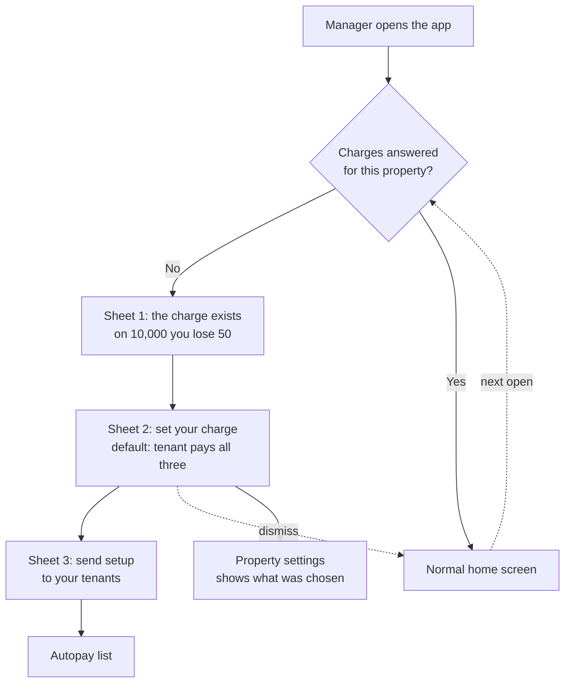
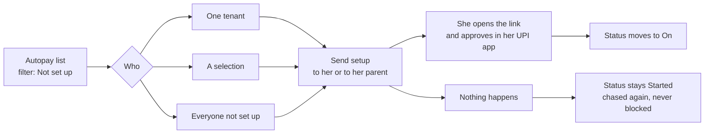
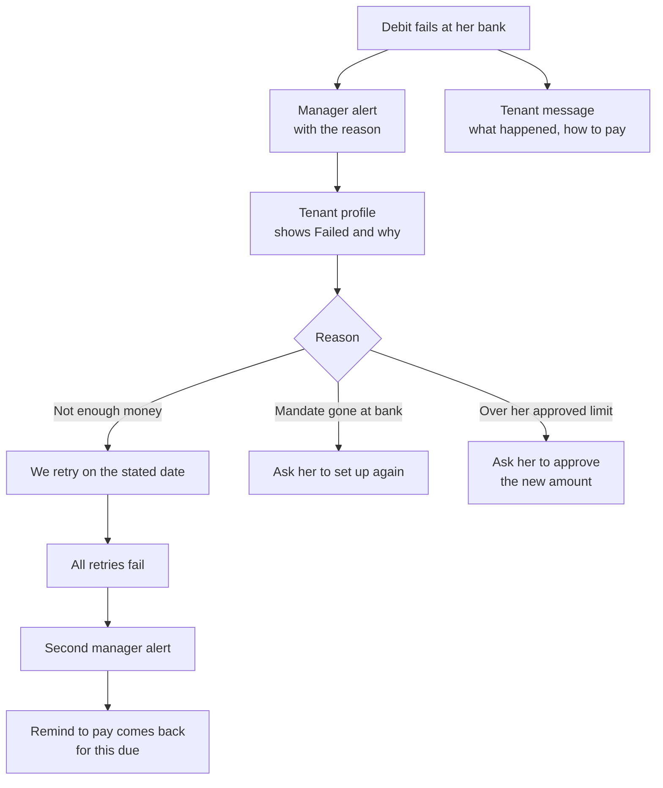
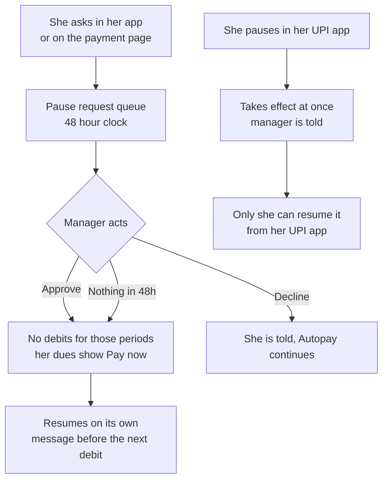
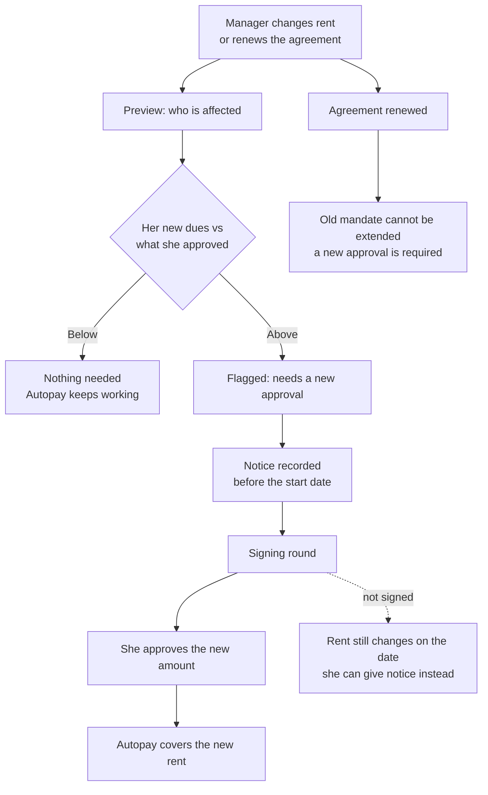

# Autopay: the manager app

Every screen in the RentOk Manager app that Autopay touches. What it shows, what the manager can do,
what happens next, and what must not be changed.

**Who this is for.** An engineer or designer picking up one screen. You should not need to read the
feature map, the decision log, or any code to build from this page.

**How to read it.** Section 2 is the whole thing in one table. Section 3 is the manager's five jobs
with the flow of each. Section 4 is the screen by screen spec, which is where you build from.
Section 5 is what is broken today. Section 6 says what ships when. Section 7 is the list of things
that will break other screens if you touch them.

**Status.** Written 21 Sep 2026 against the feature map v4 and the decision log. Every claim about
today's behaviour was read in the Flutter app, the web app or the backend on that date. Rulings are
cited as R numbers so you can trace any of them.

---

## 1. The one rule that shapes every screen

**A manager can never set up Autopay for a tenant, and can never pause or stop it.** It is her bank
mandate. Only she can approve it, in her own UPI app, and only she can lift a pause she made there.

So every manager surface is one of three verbs: **ask**, **see**, or **request**. None of them is
**do**. A screen that tries to switch a tenant's Autopay on or off is the wrong screen.

The two exceptions, both at property level, not tenant level: the manager sets the charges, and the
manager decides whether Autopay is *required* at his property.

---

## 2. The map

| # | Surface | Today | Target | Ships |
| --- | --- | --- | --- | --- |
| 1 | Property settings, Autopay and charges | Toggle opens on regardless of state, any save turns Autopay on. Two fee payer dropdowns. No grace field | Three charges with tenant as default bearer, grace period, required switch, no on/off switch | App: next release |
| 2 | Charges bottom sheet | Does not exist | Three screens: the problem, set your charge, send reminders. Dismissible, returns until answered | Web 1 Oct, app next release |
| 3 | Tenant profile, Autopay section | One row, "Setup Done" or "Not Setup" | Status, option, day, limit, end date, next debit, past debits, five actions | App: next release |
| 4 | Tenant profile, virtual account card | Does not exist | Her own account number, copy, share with tenant | App: next release |
| 5 | Tenant list | Autopay filter only, no badge on any row | Status badge on the row, filter keeps its two buckets | App: next release |
| 6 | Tenant passbook | No Autopay anywhere. Late Fine sheet writes grace | Low card showing her virtual account and Autopay state | App: next release |
| 7 | Passbook, Late Fine sheet | Grace field, stop/resume writes 1000 | Unchanged, but must stop colliding with the Autopay window | Backend first |
| 8 | Record payment | No Autopay check at all | Warns when a debit is already raised for this due | App: next release |
| 9 | Remind to pay | Sends a link for every due | Hidden for dues Autopay will collect. Shown after a failure | App: next release |
| 10 | Request payment via Autopay | Does not exist | Third button on a due. **Deferrable**, see section 8 | Deferred |
| 11 | Autopay list | Does not exist | Per property and across properties, 13 states, filters, export | Web 1 Oct, app next release |
| 12 | Pause request queue | Does not exist | Approve or decline, 48 hour clock | Web 1 Oct, app next release |
| 13 | Alerts | No debit failure alert exists anywhere | Five manager alerts, each paired with a tenant message | App: next release |
| 14 | Send setup | Bulk reminder to a whole property, no count | One tenant, a selection, or everyone not set up | App: next release |
| 15 | Autopay rate | Does not exist | Per property, trended against the portfolio | Web 1 Oct |
| 16 | Rent change | Rent is a plain editable field | Preview, notice, signing, then a new approval where needed | Web 1 Oct |
| 17 | Agreement renewal | No Autopay step | Renewal carries a fresh mandate approval | Web 1 Oct |
| 18 | Move-out and eviction | Mandate is left running | Mandate cancelled after the last debit | Backend first |
| 19 | Copy settings to properties | Copies Autopay fields, misses grace | Same, with grace included and a blast radius warning | App: next release |
| 20 | Team permissions | None for Autopay | Each action gated and logged | Web 1 Oct |

---

## 3. The manager's five jobs

### Job 1: turn it on and decide who pays

The sheet is dismissible and comes back until the property has either set the charges or declined
them. Declining is a real answer and is recorded, so it stops asking.

### Job 2: get tenants set up

Autopay is required by default at every property (R20, R37). **Required means chase, never block**
(R21). Nothing in the app is ever locked because a tenant has not set up Autopay.

### Job 3: a debit fails

Today none of this exists. There is no failure field, no screen and no string for a failed debit
anywhere in the manager app.

### Job 4: she asks for a pause

The two pauses are different and the app must say which one it is. A RentOk pause can be lifted by
her or by the property. A pause she made in her UPI app can only be lifted by her, and telling a
manager to "ask RentOk" for that one is a dead end.

### Job 5: rent changes, or the agreement renews

**A mandate cannot be extended.** The provider does not allow it. Every renewal needs a fresh
approval, which is why the renewal signing visit has to carry it (R50).

---

## 4. Screen by screen

### 4.1 Property settings: Autopay and charges

**Today.** The Enable Autopay switch is hardcoded on when the sheet opens, and the line that would
read the property's real setting is commented out. Opening the sheet from the promo banner and
pressing Save turns Autopay on for the property. The whole Autopay card is hidden when Autopay is
off, so the other settings cannot be seen or corrected. There is no grace period field. RentOk is
written as bearer 3 where the backend expects 0, on 1,655 properties.

**Target.**

| Setting | Default | Range | Who can change it |
| --- | --- | --- | --- |
| Autopay required | On | On or off | Manager with permission, and support |
| Setup charge, who bears it | Tenant | Tenant or management | Manager with permission |
| Monthly charge, who bears it | Tenant | Tenant or management | Manager with permission |
| Platform fee line, who bears it | Tenant | Tenant or management | Manager with permission |
| Platform fee amount | 58, or 49 plus GST if the property is GST registered | 58 to 118 | Manager with permission |
| Autopay grace period | 7 days | 0 to 20 | Manager with permission |
| Eligible for tenants joined since | Beginning | Any date | Manager with permission |
| RentOk messages your tenants | On | On or off | Manager with permission |

**There is no Autopay on or off switch** (R61). Only *required* can be turned off, and existing
mandates keep running when it is. This replaces the switch that exists today.

**Every state.**

| State | What he sees | What he can do |
| --- | --- | --- |
| Not answered yet | The charges sheet, on open | Set, or decline |
| Set, tenant bears | The three charges, each marked Tenant | Move any one to management |
| Set, management bears one or more | Each marked Management | Move it back |
| Fee line off | "Your property covers RentOk's charge for each tenant" | Turn it on, which starts the notice |
| Amount out of range | "Choose between 58 and 118 a month" | Fix it |
| Change pending | "80 from 1 Nov. Notice sent to 60 of 64 tenants" | Cancel before the start date |
| Required off | "Autopay not required here. Existing Autopay keeps working" | Turn it back on |
| No permission | Greyed, "You do not have access to change this" | Ask an admin |

**Not in scope here.** The fee on the tenant's bill and its notice. Changing the amount later, which
goes through the rent change flow. The per-tenant exception, which lives on her profile.

### 4.2 The charges bottom sheet

Three screens, in order, dismissible at any point, returning on the next open until the property has
set or declined.

| Screen | Content | Action |
| --- | --- | --- |
| 1 | The charge now exists. On 10,000 collected you lose about 50. It applies to your own bank account too. RentOk has a better answer | Next |
| 2 | Set your charge. Default is the tenant pays all three. Flat, whatever the rent, and the same on every payment method | Set, or Not now |
| 3 | Send the setup message to your tenants | Send, or Skip |

**Not in scope.** Any version that blocks the manager from using the app. It is dismissible.

### 4.3 Tenant profile: the Autopay section

**Today.** One row, "Setup Done" or "Not Setup", from a single flag. A tenant waiting on her bank, a
paused one, a cancelled one and one who never started all draw the same red cross.

**Target.** Her status, option, day, approved limit, end date, next debit with its amount, and past
debits with reasons.

**Five actions, and none of them is "enable".**

| Action | What it does |
| --- | --- |
| Send setup | Sends her the link, or her parent's link |
| Change her day | Only on her request, only inside her allowed days, once a month |
| Make Autopay not required for her | With a reason, recorded. Her mandate keeps working if she has one |
| Request a pause or stop | Goes to RentOk support with a reason. Her status shows "Waiting on RentOk" |
| Send virtual account setup | See 4.4 |

**Not in scope.** Pausing, stopping or cancelling directly. Changing her option or her bank.

### 4.4 Tenant profile: her virtual account

**Today.** Does not exist.

**Target.** A card with the account number RentOk created for this tenant, a copy control, and
"share with tenant". Money sent to that account by IMPS, NEFT or RTGS is matched to her
automatically. The same account is what an e-NACH setup uses.

**Not in scope.** Creating or changing the account from this screen. It is read and shared only.

### 4.5 Tenant list

**Today.** An Autopay Status filter with two buckets, behind "All filters". No badge, column or card
on any row, so a manager can narrow the list by Autopay and then cannot read it.

**Target.** A status badge on the row using the short form of the 13 states. The filter keeps its two
buckets, and a third is added for "started but not finished", which is the population the whole push
is aimed at.

**Open.** Which of the 13 states the "Autopay Enabled" bucket covers. Whatever is decided, the label
a manager reads has to match it.

### 4.6 Tenant passbook

**Today.** No Autopay anywhere on it. The Late Fine sheet sits in the bottom bar.

**Target.** A low card showing her Autopay state and her virtual account, consistent with the profile.

**Not in scope.** Any Autopay action. The passbook shows, it does not act.

### 4.7 Passbook: the Late Fine sheet

**Today.** A grace period field capped at 28 days, and a stop or resume toggle that writes 1000 to
mean "late fine off for her".

**This is the screen most likely to be broken by Autopay work, and it needs no visible change.** The
same number it writes is what the Autopay debit day check reads. Setting up Autopay overwrites it
with the property's Autopay grace, and cancelling Autopay wipes it, which silently switches a
manager's "no late fine for this tenant" back on. The fix is in the backend, splitting the two
meanings apart. See 5.4.

**Not in scope.** Changing this sheet before the backend split lands.

### 4.8 Record payment

**Today.** No Autopay check of any kind. Nothing tells the manager that a debit is already on its way
for the same due.

**Target.** When a debit has already been raised for this due, the sheet says so before he records
anything, with the amount and the date, and offers to wait.

**What actually protects us today is an accident**, not a guard: the debit engine only collects
unpaid invoices, so a cash payment recorded before the debit runs makes the debit skip. If the cash
lands after the debit has been raised at the provider, nothing stops it.

### 4.9 Remind to pay

**Today.** Sends a payment link for any due, whether or not Autopay will collect it.

**Target.** Hidden for dues Autopay is going to take (R9). It comes back after a failed debit, for a
paused period, and for dues Autopay will not take, which includes late fines.

### 4.10 Request payment via Autopay

**Deferred.** See section 8.

Third button on a due, beside Record payment and Remind to pay. The tenant gets "requested X, will
be taken after 24 hours through your Autopay", with Approve and Pay manually. There is no reject.
Works for any due except late fines, which stay link only (R29, R51). A request above her approved
limit needs a new approval.

### 4.11 The Autopay list

**Today.** Does not exist.

**Target.** Per property and across properties, with filters and **export**.

The 13 states:

| State | What it means | What the manager does |
| --- | --- | --- |
| Not set up | No mandate | Send setup |
| Started | She began and did not finish | Send setup again |
| On, Option 1 or 2 | Working | Nothing |
| Pause requested | Waiting on him, 48 hour clock | Approve or decline |
| Paused until {month} | Approved pause | Nothing, it resumes itself |
| Waiting on RentOk | He asked support to pause or stop | Wait |
| Waiting for bank approval | e-NACH in progress | Wait |
| Needs new approval | Her dues are above what she approved | Ask her to approve the new amount |
| Failed, with the reason | The last debit did not go through | Depends on the reason |
| Ending soon | Mandate ends within 15 days | Renewal ask |
| Ended | Agreement end reached, not renewed | Set up again |
| Cancelled | She cancelled | Send setup, within message limits |
| Not required | Exception set for her | Nothing |

### 4.12 The pause request queue

**Today.** Does not exist.

**Target.** A queue of her requests, each with a 48 hour clock. Approve or decline. Silence for 48
hours counts as approved, and the manager is told that is what happened.

### 4.13 Alerts

**Today.** No debit failure alert exists anywhere in the app. There is no notification centre and no
per-type preference screen. The only payment failure sheet in the app is for RentOk's own
subscription, not for a tenant's rent.

**Target.** Five alerts to the manager. **Each one is paired with the message the tenant gets**, so
the two sides never disagree about what happened.

| Event | Manager is told | Tenant is told |
| --- | --- | --- |
| A debit failed | Which tenant, the reason, when we retry | What happened, how to pay now, when we try again |
| All retries failed | Which tenant, the reason | Pay by link, with the link |
| She changed her day, paused, resumed or cancelled | What she did and when | Confirmation of what she did |
| She answered a payment request | Approved, paid, or moved to manual | Confirmation |
| Renewals due in 15 days | Which tenants | Ask to approve the new term |

### 4.14 Send setup

**Today.** One bulk reminder to a whole property, with no recipient list, no count and no protection
against sending twice. It also skips everyone who ever started, which is the population most worth
chasing.

**Target.** One tenant, a selection, or everyone not set up, in one action, to her or to her parent.
Shows the count before sending and the result after.

### 4.15 Autopay rate

**Today.** Does not exist.

**Target.** Per property, trended, shown next to the portfolio's rate. A mandate counts only when a
debit is queued for it or it is waiting for its first due (R54), so a property cannot look good on
mandates that never collect.

### 4.16 Rent change

**Today.** Rent is a plain editable text field on the tenant profile. No effective date, no
confirmation, no history, and no warning that the tenant is on Autopay.

**Target.** The rent change flow, which is a manager web screen for 1 Oct. Choose, preview, schedule,
sign, notice, track. The preview flags every tenant whose new dues will exceed what she approved.

**In the app, for now:** the rent field warns when the tenant has a live mandate and sends the
manager to the proper flow. It does not silently change rent under a mandate.

### 4.17 Agreement renewal

**Today.** The renewal screen writes the new rent and the new end date and does not touch the mandate
at all.

**Target.** Renewal carries an Autopay step, because the old mandate cannot be extended and must be
replaced with a new approval.

### 4.18 Move-out and eviction

**Today.** Nothing cancels the mandate. It stays active with a pending schedule and a live
authorisation at the provider.

**Target.** The mandate is cancelled after the final settlement debit, and she is told. Eviction,
deletion and transfer out all end it the same way. This is backend work; the eviction screens need
no new control.

### 4.19 Copy settings to other properties

**Today.** Copies the Autopay fields to every selected property. On web it silently drops the grace
period even though that field is edited on the same screen.

**Target.** Include grace. Show the number of properties and the number of tenants affected before
confirming, because this is the widest blast radius in the app.

### 4.20 Team permissions

**Today.** None for Autopay.

**Target.** Each of these actions is gated and every use is logged: view the Autopay list, send
setup, make Autopay not required for a tenant, make it not required for a property, ask RentOk to
pause or stop, approve or decline pause requests, change a tenant's day, request payment via Autopay,
edit the charges, change rent.

**Open.** Whether these are ten separate permissions or a smaller set of groups. My recommendation is
four groups: see, chase, change money, change tenancy. Ten switches is a settings screen nobody
configures correctly.

---

## 5. What is broken today

### 5.1 Rent rises and the mandate does not follow

The ceiling a tenant approves is written once and **never updated by any code path in the system.**
Her invoice, meanwhile, is regenerated from her current rent minutes before each debit.

So when rent rises: the bill moves, the ceiling does not, and the debit is truncated to fit. No
error, no flag, no alert. The truncated figure is written to the schedule, so the record looks
consistent and the shortfall is invisible to every screen that reads it. She accrues arrears and then
late fines while holding an Autopay she believes is paying her rent.

There is also a job that raises rent 10 percent automatically for a fixed list of properties, with
its notification block commented out. Rent rises, nobody is told, and the above happens silently.

### 5.2 No mandate ever ends

The mandate's end date is never written anywhere. Every mandate in the system is unbounded. Agreement
renewal does not touch it, and move-out does not cancel it.

### 5.3 Settings save turns Autopay on

Covered in 4.1. One save from the promo banner switches Autopay on for the property.

### 5.4 One number means three things

`tenant.grace_period` is the per-tenant late fine override, **and** it carries 1000 as a magic value
meaning "no late fine for her", **and** it is what the Autopay debit day check reads.

Setting up Autopay overwrites it with the property's Autopay grace. Cancelling Autopay wipes it,
which turns a manager's "no late fine for this tenant" back on without telling anyone. And a tenant
carrying 1000 passes every Autopay day check, because her allowed window becomes her due day plus a
thousand days.

There are three grace columns in total, and the two the manager sees are edited in three different
places. The property late fine grace and the "Automatic Late Fine" due type grace are **the same
row**, reached through two front doors.

### 5.5 The two apps disagree about three fields

| Field | Manager app | Manager web |
| --- | --- | --- |
| Autopay grace period | Missing | Present, labelled as a late fine setting, which is wrong |
| Per-tenant grace and late fine | Present, in the passbook | Missing |
| Per-tenant Autopay status | Present, on the profile | Missing entirely |

---

## 6. Ship order

**Manager web, before 1 Oct:** the charges sheet, the Autopay list with export, the pause queue, the
Autopay rate, the rent change flow, team permissions.

**Manager app, until the next release:** app-only managers get the pause approvals, the payment
requests and the Autopay list as WhatsApp messages with links to manager web. The app is not blocked,
and no manager is stuck.

**Manager app, next release:** everything in section 4 marked "App: next release".

**Backend first, before any screen:** the grace split, the mandate end date, cancel at move-out, and
the failure reasons that the alerts in 4.13 have nothing to show without.

---

## 7. Do not touch

**Three different fields are already called `autopay_status`, all of them integers, and none is the
mandate's own state.** One is the property's on and off, one is the tenant app's, one is the manager
app's per-tenant flag.

The new Autopay states are new words for new screens. **They must not be sent on any of those three
fields.** If a string arrives on them:

- the manager app's whole Dues and Payment screen fails to load, taking partial payments, cash, GST,
  settlement rules and receipt terms with it;
- the tenant app fails to start, because the evicted tenant redirect rides the same response;
- on manager web the Autopay toggle reads Off on a live property, and the next Save **switches
  Autopay off for real**, for twenty properties at once through the copy action.

Flutter releases are not forced, so an app that has not been updated will keep reading the old field.
Leave the three integer fields exactly as they are.

**Also do not:** ship the webhook event name fix on its own, which deactivates every live mandate;
change the Late Fine sheet before the grace split lands.

---

## 8. Deferred, and open

**Deferred: Request payment via Autopay (4.10).** Wanted, but it depends on what the payment provider
will allow on an on demand mandate and on our own bandwidth. It is the first thing to cut and the
rest of the document does not depend on it.

**Open, and each one is a decision rather than a build question:**

| # | Question | Blocks |
| --- | --- | --- |
| 1 | The flat charge amount. The feature map says 58. The 18 Sep meeting moved between 10, 15 and 20 and ended undecided | The charges sheet's numbers |
| 2 | Tenant borne setup and monthly Autopay charges were retired by R11 on the ground that the e-mandate rules forbid charging a customer for the mandate. The current ruling restores them. **Srijan and a payments lawyer to close.** | Nothing in the build. Recorded so it is not lost |
| 3 | Which of the 13 states counts as "Autopay Enabled" in the tenant filter | 4.5 |
| 4 | Who funds the discount for tenants on Autopay, RentOk or the property | The charges sheet's wording |
| 5 | Ten permissions or four groups | 4.20 |

---

## Where the rest lives

Rulings and their reasons: `decisions/decision-log.md`. The full product: `map/feature-map.md`.
Ticket drafts: `map/build-tickets.md` and D1 to D7. Nothing in this document contradicts those; where
it looks like it does, they win and this is wrong.
