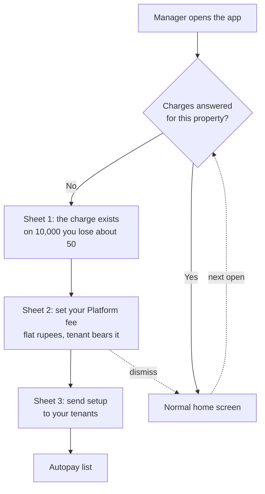
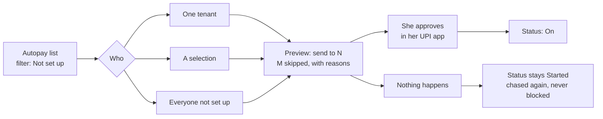
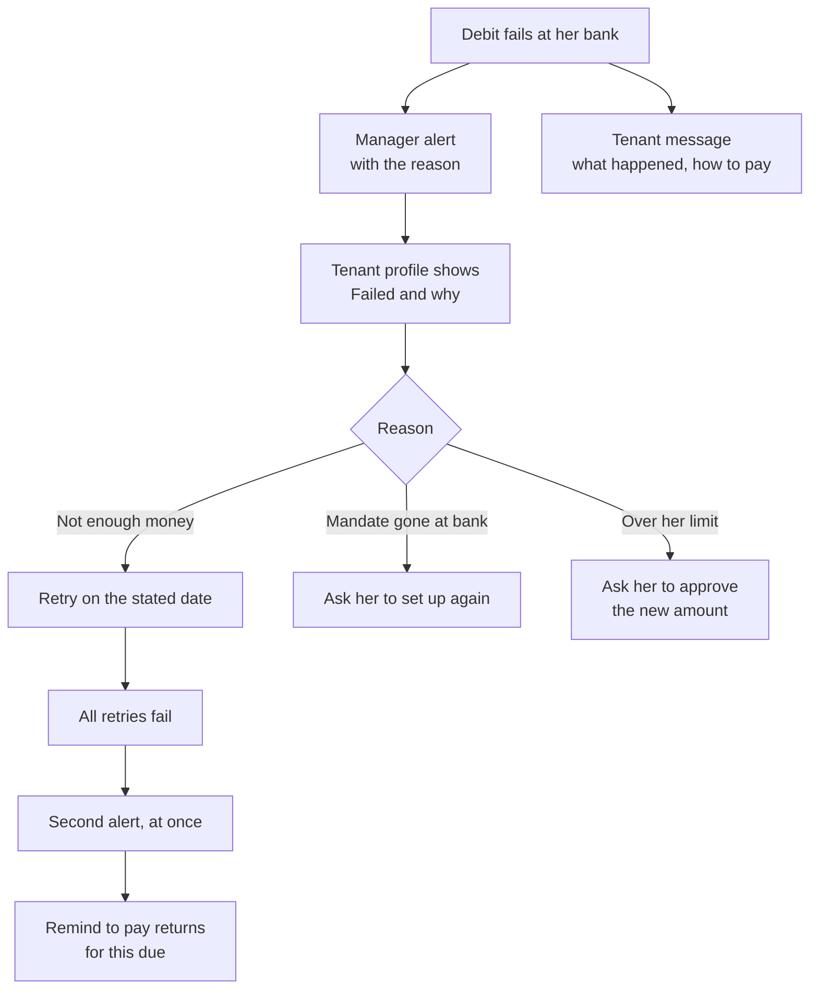
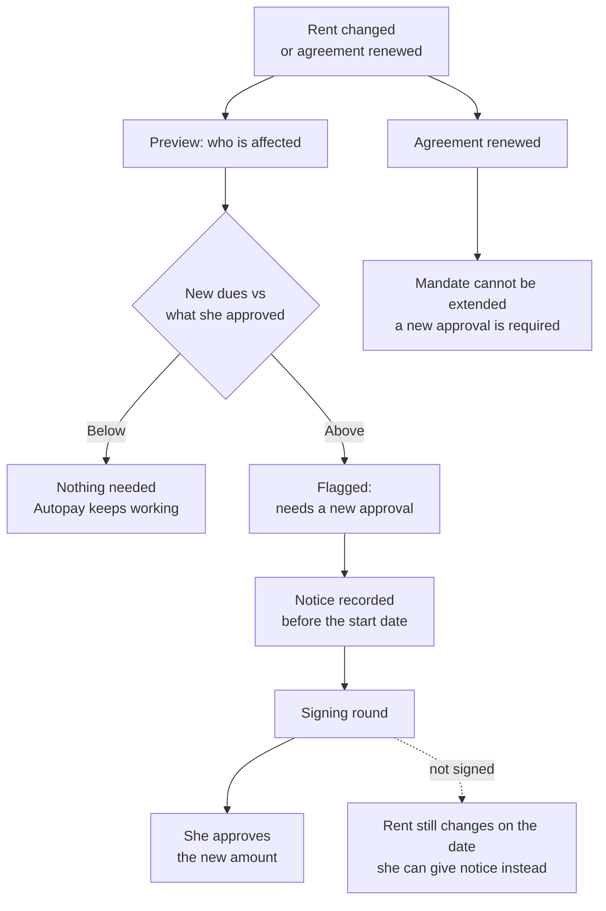

# Autopay: the manager app

The manager app seen whole. The build tickets D1 to D7 and the rest specify each piece; they are
organised by workstream, so nobody can currently see one surface end to end. This page is that view,
and it points at the ticket for every detail rather than repeating it.

**Read the ticket for what to build. Read this for what the surface is, what breaks today, what not
to touch, and what is still waiting on a person.**

Code was read on `rentok-backend` origin/master, `rentokmanagerflutter` origin/main and
`rentok-manager-web` origin/main, 21 and 22 September 2026. Production figures were run on those
dates. **Checked against rulings R1 to R64.** Markers follow the repo: **(agreed)**
confirmed by Sanchay, **(proposed)** waiting on his yes.

---

## 1. The one rule

A manager can never set up Autopay for a tenant, and can never pause or stop it (R39, R45). It is her
bank mandate. Only she can approve it, in her own UPI app, and only she can lift a pause she made
there.

So every manager surface is one of three verbs: **ask**, **see**, or **request**. None of them is
**do**.

Two exceptions, both at property level and never at tenant level: the manager sets the charges, and
the manager decides whether Autopay is *required* at his property (R20, R38, R61).

---

## 2. The map

| # | Surface | Today | Specified in | Ships |
| --- | --- | --- | --- | --- |
| 1 | Property settings, Autopay and charges | Toggle opens on whatever the state, any save turns Autopay on. Two fee payer dropdowns. No grace field | **D4** | App: next release |
| 2 | Charges bottom sheet | Does not exist | **Not ticketed.** Only in the 18 Sep meeting record | Web 1 Oct, app next |
| 3 | Tenant profile, Autopay section | One row, Setup Done or Not Setup | **D1** | App: next release |
| 4 | Tenant profile, virtual account card | Does not exist | **Not ticketed.** From the PRD | App: next release |
| 5 | Tenant list | Autopay filter only, no badge on any row | **D1** | App: next release |
| 6 | Tenant passbook | No Autopay anywhere | **Not ticketed** | App: next release |
| 7 | Passbook, Late Fine sheet | Grace field, stop and resume writes 1000 | **S2**, backend #7049 | Backend first |
| 8 | Record payment | No Autopay check at all | **B4** | App: next release |
| 9 | Remind to pay | Sends a link for every due | **E1**, **B3** | App: next release |
| 10 | Request payment via Autopay | Does not exist | **C4**. Deferred, see section 8 | Deferred |
| 11 | Autopay list | Does not exist | **D1** | Web 1 Oct, app next |
| 12 | Pause request queue | Does not exist | **C2** | Web 1 Oct, app next |
| 13 | Alerts and the activity log | No debit failure alert exists anywhere | **D3** | App: next release |
| 14 | Send setup | Bulk reminder to a property, no count | **D2** | App: next release |
| 15 | Autopay rate | Does not exist | **D1** rate, **E4** counting rules | Web 1 Oct |
| 16 | Rent change | Rent is a plain editable field | **D7** | Web 1 Oct |
| 17 | Agreement renewal | No Autopay step | **C5** | Web 1 Oct |
| 18 | Move-out and eviction | Mandate is left running | **C6**, **B5** | Backend first |
| 19 | Copy settings to properties | Copies Autopay fields, misses grace | **D4** | App: next release |
| 20 | Team permissions | None for Autopay | **D3** | Web 1 Oct |
| 21 | The UPI charge notice | Does not exist | **Not ticketed.** From the PRD | App: next release |
| 22 | Global debit stop, ops counters | Do not exist | **E3**, **E4** | Before the push |

**Four surfaces are not ticketed.** The charges sheet, the virtual account card, the passbook card
and the UPI charge notice. They come from the PRD and the 18 September meeting, not from the map, so
nothing specifies their states yet. That is the gap to close first.

---

## 3. The manager's jobs

Four flows. The fifth, a pause request, is already drawn as diagram 5 in `map/diagrams.md`; use that
one rather than a second copy.

### Turn it on and decide who pays

Dismissible, and it returns until the property has set the charges or declined them **(agreed)**.
Declining is a real answer and stops the asking.

### Get tenants set up

Required means chase, never block (R21). Nothing in the app is ever locked because a tenant has not
set up Autopay.

### A debit fails

None of this exists today. There is no failure field, no screen and no wording for a failed debit
anywhere in the manager app.

### Rent changes, or the agreement renews

A mandate cannot be extended, so every renewal needs a fresh approval, 15 days ahead (R50, C5).

---

## 4. Screen by screen

The ticket owns the states, the copy and the done-when list. This table carries only what the ticket
does not: which app it lives in, and what is already wrong there.

| Surface | Lives in | Ticket | What the ticket does not carry |
| --- | --- | --- | --- |
| Property settings | Both | D4 | The app hides the whole Autopay card when Autopay is off, so the other fields cannot be corrected (`dues_payment.dart:158`). Web always shows them |
| Charges sheet | Both | none | No states written anywhere. It suggests a fee from the property's average rent, section 7 |
| Tenant profile section | Both | D1 | Web has no Autopay on the tenant profile at all, so the app and web disagree about what a manager can see |
| Virtual account card | Both | none | No states written. It is Cashfree's account in Cashfree's escrow, never RentOk's own |
| Tenant list | Both | D1 | Neither app shows a badge on the row today. Filter codes 402 and 403 match exactly across both |
| Passbook | Both | none | Web's passbook has no per-tenant late fine or grace; the app's does. Corrected 22 Sep |
| Late Fine sheet | App only | S2, #7049 | **No visible change until the backend grace split lands.** See section 5 |
| Record payment | Both | B4 | Today's protection is an accident, not a guard. See section 5 |
| Remind to pay | Both | E1, B3 | Hidden for dues Autopay will collect (R9) |
| Autopay list | Web first | D1 | Does not exist in either surface |
| Pause queue | Web first | C2 | Does not exist in either surface |
| Alerts, activity log | Both | D3 | No failure alert exists. The app has no notification centre and no per-type preferences |
| Send setup | Both | D2 | The app's bulk reminder skips everyone who ever started, which is the population most worth chasing |
| Autopay rate | Web | D1, E4 | Does not exist |
| Rent change | Web | D7 | In the app, rent is a bare field with no warning that she is on a mandate |
| Agreement renewal | Both | C5 | The renewal screen does not touch the mandate |
| Move-out | Both | C6, B5 | Nothing cancels. See section 5 |
| Copy to properties | Both | D4 | Web silently drops the grace period. The app posts the whole config, which is safe: the backend guards every field with `NotNullUndef` |
| Team permissions | Web | D3 | **Ten permissions, each its own switch (agreed).** Day-one defaults are (proposed) in D3 |
| UPI charge notice | Both | none | No states written. The manager must see what the tenant sees |

### Where the two surfaces disagree

| Field | Manager app | Manager web |
| --- | --- | --- |
| Autopay grace period | Missing | Present, labelled as a late fine setting, which is wrong |
| Per-tenant grace and late fine | Present, in the passbook | Missing |
| Per-tenant Autopay status | Present, on the profile | Missing entirely |
| Old tenant reminders | Missing | Present |
| Paid via Autopay, dues filter | Present | Missing |

---

## 5. What is broken today

Traced first-hand on 22 September 2026. None of this is in the tickets.

### Rent rises and the mandate does not follow

`autopay.plan_amount` is written once at insert and **updated by no code path in the repository**
(`rentok-backend` origin/master; nine update call sites, none touches it). Her invoice is regenerated
from her current rent minutes before each debit (`autopayV2.ts:300-305`).

So when rent rises: the bill moves, the ceiling does not, and the debit is truncated by
`Math.min(unpaid, remaining)` (`autopayV2.ts:318-339`). No error, no flag, no alert. The truncated
figure is written to the schedule, so the record looks consistent and the shortfall is invisible to
every screen that reads it. She accrues arrears and then late fines while holding an Autopay she
believes is paying her rent.

A cron also raises rent 10% for a fixed list of properties with its notification block commented out
(`services/cron/agreementRenewal.ts:165-212`).

### No mandate ever ends

`autopay.end_date` is never written anywhere (`entities/autopay.ts:31`). Every mandate is unbounded.
Agreement renewal does not touch it and move-out does not cancel it.

### Move-out leaves a live authorisation

`cancelSubscription` has no caller outside the Autopay module. Charging only stops because no unpaid
rent invoice is found, which is an accident and not a guard.

### One number means three things

`tenant.grace_period` is the per-tenant late fine override, it carries 1000 as a magic value meaning
no late fine for her, and it is what the Autopay debit day check reads
(`autopayV2Helpers.ts:11-15`). Setting up Autopay overwrites it with the property's Autopay grace
(`autopayV2.ts:863-869`); cancelling wipes it to null (`:837-839`), which turns a manager's "no late
fine for this tenant" back on without telling anyone.

There are three grace columns. The property late fine grace and the Automatic Late Fine due type
grace are **the same row** reached through two front doors
(`v1/list_screens/dues/packagesFilterHelper.ts:65-110`).

### A settings save turns Autopay on

`isAutopayEnabled` is hardcoded true and the line reading the real value is commented out
(`autopay_settings_bottom.dart:32`, `:56`). Every save sends `autopayStatus: 1` (`:641`).

---

## 6. Ship order

**Manager web before 1 Oct:** the charges sheet, the Autopay list with export, the pause queue, the
Autopay rate, the rent change flow, team permissions.

**Manager app until the next release:** app-only managers get pause approvals, payment requests and
the Autopay list as WhatsApp links to manager web (proposed, D1). Nobody is blocked.

**Backend before any screen:** the grace split, the mandate end date, cancel at move-out, and the
failure reasons that D3's alerts have nothing to show without (#6817, #7003).

---

## 7. Do not touch

**Three fields are already called `autopay_status`, all integers, and none is the mandate's state.**
One is the property's on and off, one is the tenant app's, one is the manager app's per-tenant flag.

The new Autopay states are new words for new screens. **They must not be sent on any of those three
fields.** If a string arrives on them:

- the manager app's whole Dues and Payment screen fails to load, taking partial payments, cash, GST,
  settlement rules and receipt terms with it (`property_config_res.dart:300`);
- the tenant app fails to start, because the evicted tenant redirect rides the same response
  (`tenant_app_status_res.dart:25`);
- on manager web the toggle reads Off on a live property and the next Save switches Autopay off for
  real, for twenty properties at once through the copy action (`PaymentSettings.tsx:63`, `:211`).

Flutter releases are not forced. Leave the three integer fields exactly as they are.

**Also do not:** ship the webhook event name fix on its own, which deactivates every live mandate;
change the Late Fine sheet before the grace split lands; compute the Platform fee as a percentage of rent at run time, section 7.

**The charge model.** One tenant-facing charge exists: the Platform fee, fixed rupees, identical on
every method including cash, borne by the tenant by default, and the manager may absorb it. **The
amount is suggested from the property's average rent** (Sanchay, 22 Sep): ₹58 is a placeholder that
suits a median property, and a property whose tenants pay ₹1,00,000 does not get the same figure as
one whose tenants pay ₹8,000. The sheet suggests, the property sets, and the fee is then fixed
rupees on her bill every month whatever she does. **This is R64**, his ruling of 21 and
22 September, now recorded in `decisions/decision-log.md` with what it deletes and why it does not
reopen R11.

**The one thing that must not happen is the arithmetic, not the scaling.** A ladder of published
prices by rent band is ordinary pricing. A rule that computes the fee as 0.5% of rent, chosen
because 0.5% is the UPI charge plus tax, makes the fee provably the UPI charge under another name,
which the Finance Ministry FAQ Q34 forbids passing to a customer. Same number, different provenance,
and the provenance is the part that sits in our own screens and code. Ladder, never rate. The
Autopay setup fee and monthly fee are deleted and must not return (R11; RBI e-mandate framework
para 10(a) bans a charge for *availing* the facility, which catches a per-debit fee as much as a
one-time one). Autopay is sold with a discount on the Platform fee, never with a lower price than
another method (R63). Detail and sources: `meetings/2026-09-18-srijan-autopay/fee-map.md` section 6
and `legal-check.md` items 1 to 4, in the internal repo. That check is research, not legal advice.

---

## 8. Deferred, and what is waiting on a person

**Deferred: Request payment via Autopay (C4)** (agreed). It depends on what the provider allows on an
on demand mandate and on our bandwidth. Nothing else here depends on it.

**Everything unanswered lives in `decisions/open-questions.md`, not here.** Nine items from the
manager tickets were added to it on 22 September: five from D1, two from D2 and two from D3. The
three that block a manager screen most directly:

- which status shows when two apply at once, which every row in the Autopay list depends on;
- how the Autopay rate is counted, which decides whether the list and the daily target agree;
- alert timing, whether events with a clock fire at once and the rest at 09:00.

---

## Where the rest lives

`map/feature-map.md` is the only document to build from. `decisions/decision-log.md` holds the
rulings, `decisions/open-questions.md` what is unanswered, `map/diagrams.md` the eight agreed
diagrams. Ticket drafts D1 to D7 are in the internal repo. Nothing here contradicts those; where it
looks like it does, they win and this is wrong.
