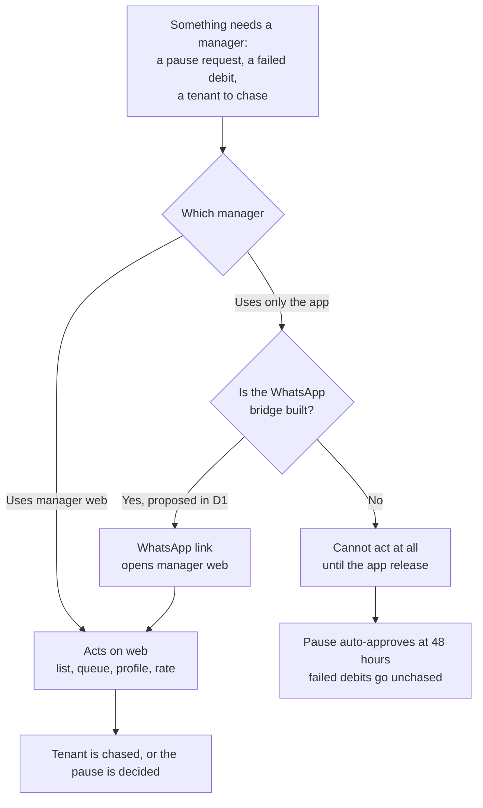
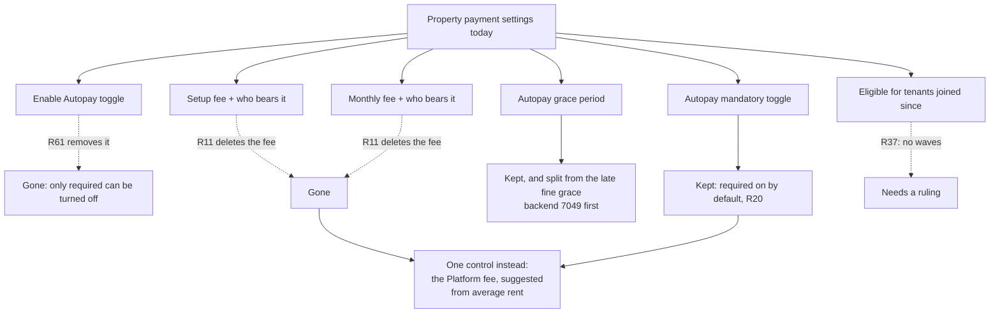

# Autopay: manager web

Manager web seen whole. Almost every build ticket touches it, D1 to D7 most of all, with C1 to C6,
A3, E1 and E3 landing here too; they are organised by workstream, so nobody can currently see the
surface end to end. This page is that view, and it points at the ticket for every detail rather than
repeating it.

**Read the ticket for what to build. Read this for what the surface is, what breaks today, what not
to touch, and what is still waiting on a person.**

Code was read on `rentok-manager-web` origin/main `5311f662`, `rentokmanagerflutter` origin/main and
`rentok-backend` origin/master `1498fcd62`, all on 22 September 2026. **Checked against rulings R1 to R65.** Markers follow the repo: **(agreed)** confirmed by Sanchay, **(proposed)**
waiting on his yes.

This is the last of the five surface documents. The others are `manager-app.md`, `payment-page.md`,
`tenant-app.md` and `web-check-in.md`.

---

## 1. The one rule

**This is the only manager surface that can ship before 1 October, and it is the one with the least
Autopay in it.**

The manager app waits for a release after the 18 September freeze. So every manager capability the
push needs lands here or lands nowhere: the Autopay list, the pause queue, the Autopay rate, the
rent change flow, team permissions, the charges sheet and the tenant profile section.

Against that, the whole of Autopay in manager web today is **two files**: the property payment
settings, and two entries in the tenant list filter. A search of the repository for Autopay returns
nothing else.

So the surface carrying the entire manager line for 1 October is the one furthest behind, and it is
**behind the manager app**, which at least shows a per-tenant Autopay row and the per-tenant grace
controls.

Two things follow.

**App-only managers have no path at all until the release.** D1 proposes bridging them with WhatsApp
links into manager web (proposed). That is not a convenience; without it an app-only manager cannot
approve a pause, send setup in bulk, or see a single Autopay status during the push. How many
managers only ever open the app is **not measured**, and it decides how much of the manager line
actually reaches anyone.

**What is here today is the old charge model, still being sold.** Two bearer dropdowns, a setup fee,
a monthly fee and an illustrated modal with a struck-out price. R11, R35 and R61 deleted all of it.
Section 5.

---

## 2. The map

| # | Surface | Today | Specified in | Ships |
| --- | --- | --- | --- | --- |
| 1 | Property payment settings, Autopay block | **Exists**, and carries the deleted fee model, section 5 | **D4** | 1 Oct |
| 2 | Autopay grace period field | Exists here, missing in the app | **D4**, **S2**, backend#7049 | Backend first |
| 3 | "Eligible for tenants joined since" | **On screen, saved, and read by nothing**, section 5 | **Not ticketed** | Needs a ruling |
| 4 | The charges sheet that pushes a property to set the fee | Does not exist | **Not ticketed.** From the 18 Sep meeting and Sanchay, 22 Sep | 1 Oct |
| 5 | Tenant list, Autopay filter | Two states: enabled, disabled | **D1** | 1 Oct |
| 6 | Tenant list, Autopay badge on the row | Does not exist | **D1** | 1 Oct |
| 7 | Tenant profile, Autopay section | **Nothing at all**, in any file | **D1**, **C1** | 1 Oct |
| 8 | The Autopay list, with filters and export | Does not exist | **D1** | 1 Oct |
| 9 | The Autopay rate per property | Does not exist | **D1** rate, **E4** counting | 1 Oct |
| 10 | Pause request queue, with its 48-hour clock | Does not exist | **C2** | 1 Oct |
| 11 | "Request to pause or stop Autopay" | Does not exist | **C3** | 1 Oct |
| 12 | Change her day, on her request | Does not exist | **C1**, **D1** | 1 Oct |
| 13 | Make Autopay not required for one tenant | Does not exist | **A3**, **D1** (R38) | 1 Oct |
| 14 | Send bank-account setup | Does not exist | **A3** | 1 Oct |
| 15 | Send setup: one, a selection, everyone | Does not exist | **D2** | 1 Oct |
| 16 | Alerts, and the activity log | Log drawer exists; no Autopay events | **D3** | 1 Oct |
| 17 | Team permissions for Autopay | None | **D3** | 1 Oct |
| 18 | Rent change, bulk and single, with preview | Does not exist | **D7** | 1 Oct |
| 19 | Agreement renewal with an Autopay step | Does not exist | **C5** | 1 Oct |
| 20 | Request payment via Autopay, on a due | Does not exist | **C4**. Deferred, section 9 | Deferred |
| 21 | Passbook: the payment method on a collection | **Exists**, and calls an Autopay debit "RentOk Bank Transfer", section 5 | **B1**, **D6**, backend#6835 | Backend first |
| 22 | Per-tenant late fine and grace | Not on web; the app has it | **S2**, backend#7049 | Backend first |
| 23 | Late fine settings | Under Money, dues package, not the tenant | **S2** | Backend first |
| 24 | The owner's monthly statement and Autopay tile | Do not exist | **D6** | After 1 Oct, before the first statement |
| 25 | The RentOk invoice and its payment link | Does not exist | **D6** (R32) | After 1 Oct |

**Two surfaces exist here and nowhere else in the manager's world:** the Autopay grace field and the
"eligible since" gate. **One exists in the app and not here:** the per-tenant grace and late fine.
Everything else in rows 4 to 20 has to be built from nothing, in nine days.

---

## 3. Two flows

`map/diagrams.md` draws the journey and the states, and `surfaces/manager-app.md` draws the
manager's four jobs. These two draw what is specific to web.

### Who can act, before and after the app release

The 48-hour auto-approve (R48, R50) means silence is a decision. For an app-only manager without the
bridge, silence is the only available decision.

### What the property settings must become

---

## 4. Screen by screen

The ticket owns the states, the copy and the done-when list. This table carries only what the ticket
does not: what is there today, and what is already wrong with it.

| Surface | Ticket | What the ticket does not carry |
| --- | --- | --- |
| Payment settings | D4 | It is the only place a human is shown the deleted fee model, with pictures and a struck-out price |
| Autopay grace | D4, #7049 | Present here and absent in the app, so the two surfaces already disagree about a money rule |
| Eligible since | none | Saved to the property and read by no Autopay path, so it promises an exclusion that never happens |
| Tenant list filter | D1 | Two states against D1's eighteen, and they read the property's flag rather than her mandate |
| Tenant profile | D1, C1 | Not one Autopay reference in the whole of `components/People` |
| Autopay list | D1 | The single largest new screen on this surface, and the manager's main tool for the push |
| Pause queue | C2 | Its clock decides by itself when nobody looks, so its absence is not neutral |
| Ask RentOk | C3 | The manager's only way to stop a mandate (R39), so without it he tells her to cancel instead, and she leaves the count for good |
| Permissions | D3 | Ten switches, none of which exists |
| Rent change | D7 | The whole flow is new here, and it is what carries a fee or rent change to a tenant lawfully (R13) |
| Passbook method | B1, D6, #6835 | The row already prints the method; the data does not say Autopay |
| Owner statement and tile | D6 | Nothing exists, and it is the owner's only view of what the charges cost him |

---

## 5. What is broken today

Traced first-hand on 22 September 2026, `rentok-manager-web` origin/main `5311f662`.

### The deleted charge model is still on screen, and RentOk is the default payer

Property payment settings carries a full Autopay fee model
(`components/Settings/SettingsDrawer/DrawerContents/PaymentSettings.tsx`):

- a **setup fee** with a "who bears it" dropdown (`:794-828`),
- a **monthly fee** with its own "who bears it" dropdown (`:866-899`),
- both mapping `{ 1: "Owner", 2: "Tenant", 3: "RentOk" }` (`:826`, `:898`),
- the setup bearer **falling back to "RentOk" when unset or zero** (`:828`, and `:65` in state),
- an **info modal** with four illustrations and a struck-out price, `autopay_monthly_charge_actual`
  against `autopay_monthly_charge` (`:1305-1306`),
- and an **Enable Autopay toggle** (`:643-646`).

Four rulings have already removed all of this. **R11:** the tenant bears no Autopay charge and
RentOk absorbs nothing. **R35:** the "who pays" choice is gone; RentOk charges management and the
property decides whether a Platform fee line reaches the tenant. **R61:** the property-level Autopay
off switch is removed, only "required" can be turned off. And Sanchay's instruction of 22 September
replaces the fee with one suggested from the property's average rent.

**First order:** an owner opening settings today is sold a model the product no longer has, and the
default answer on one dropdown is that RentOk pays, which R11 forbids outright.

**Second order:** whatever he picks is written to `autopay_setup_bearer` and
`autopay_monthly_bearer`, and the backend reads every value except 1 as "tenant"
(`autopayV2Helpers.ts:132-136`), which is the mismatch that refuses Autopay setup for every property
whose fee payer was never set (backend#7054, P1, open). **So the screen that sells the dead model is
also the screen that breaks setup for everyone who never touched it.**

**Third order:** D4 replaces this block, and the replacement is where the charges sheet and the fee
ladder land. Until it ships, every property onboarded sees the old model, and each one added is one
more that has to be migrated rather than defaulted.

### There is a joining-date gate nobody has ruled on

"**Eligible for Tenants joined since**", with "Beginning" or a custom date, saved to the property
config as `eligibility_date` (`:67-68`, `:206-216`, `:232`, `:249`).

R37 is explicit: no waves and no priority groups, Autopay on for every tenant and every property
from the start. This control reads as a wave selector at property level, it persists, and it appears
in no ticket and no ruling.

**It is written, logged, and never read.** Every reference to `eligibility_date` in the backend is in
the property settings save path or the entity (`src/controllers/property.ts:9450`, `:9715-9737`,
`src/entities/property.ts:982`, origin/master). Nothing in the Autopay services or in `getCheckIn`
reads it. So today it excludes nobody.

**First order:** an owner who sets it is told nothing happened, because nothing does. The change even
writes a line into the activity log saying the eligibility date was set.

**Second order:** that is the opposite failure from the one it looks like. A property that sets
"custom, 1 October" believing its older tenants are excluded will see every one of them asked. The
screen makes a promise the product does not keep, and the activity log confirms the promise.

**Third order, and this is the one to plan for:** it looks exactly like an unfinished feature, so
the likeliest future is that somebody wires it up. On that day every property with a date saved gets
a silent wave, which is R37's one prohibition, applied retroactively to settings nobody remembers
making. **Either rule it in and specify it, or take the control off the screen. Leaving an inert
switch that looks live is the worst of the three.**

### An Autopay debit is called "RentOk Bank Transfer"

The passbook prints the method on every collection
(`components/People/Passbook/TotalCollections/TotalCollectionsTable/TotalCollectionTableRow.tsx:187-190`),
through `readablePaymentMode` (`utils/commonUtils.ts:44-56`), which maps modes 203, 205, 206 and 210
to one label: "RentOk Bank Transfer". An Autopay debit arrives on 205.

So **no screen in manager web can tell an Autopay debit from a link payment.** The display exists and
the data does not (backend#6835, payments do not record that Autopay made them).

**Second order:** D6's owner statement, the payout lines and every "Paid by Autopay" marker rest on
that field. The slot is already built; one backend field lights up a row that is on screen today.

### The tenant profile has no Autopay at all

A search of `components/People` for Autopay returns nothing. Everything D1 and C1 put on her profile
(status, option, day, limit, end date, next debit, past debits, change her day, excuse her, ask
RentOk, send bank-account setup) starts from zero.

**What the app already has and web does not:** the per-tenant late fine and grace
(`lib/tenantdetails/passbook/model/late_fine_res.dart` in the app; `grace_period` appears nowhere in
`components/People`). Late fine settings on web live under Money, dues package, against the category
rather than the tenant (`components/Money/DuesPackage/LateFineSettingsModal.tsx:67`, default 5 days).

**Correction to `surfaces/manager-app.md`.** Its screen-by-screen table says "Passbook, App only,
Web has no passbook". That is wrong: manager web has a Passbook, with dues, collections, discounts,
deposits and advance. What it lacks is the **per-tenant late fine and grace** inside it, which is
what the parity table in that document says correctly. The row is corrected there.

---

## 6. Ship order

**Backend before any screen here:** the login and webhook fixes (S1), the payload and status fields
D1 reads, the grace split (#7049), the fee payer (#7054) and the payment method on a payment
(#6835). Every screen below is a view of data that does not exist yet.

**The order within manager web, by what unblocks the most:**

1. **The tenant profile Autopay section** (D1, C1). Six other things hang off it: the excuse, ask
   RentOk, change her day, send bank-account setup, her history, and the "charged wrongly" report.
2. **The Autopay list with export** (D1). The manager's tool for the whole push.
3. **The charges sheet and the property settings rewrite** (D4), which removes the dead fee model
   and lands the Platform fee.
4. **The pause queue** (C2) and **ask RentOk** (C3), because a pause decides itself in 48 hours.
5. **Send setup, in bulk** (D2).
6. **Team permissions** (D3), which gate all of the above.
7. **Rent change** (D7) and **renewal** (C5).
8. **The Autopay rate** (D1, E4).

**After 1 Oct, before the first statement in early November:** the owner statement, the tile and the
RentOk invoice (D6).

**In parallel, and it is not optional:** the WhatsApp bridge for app-only managers (D1, proposed).
Measure how many managers never open the web app first; that number decides how much of this
surface reaches anyone before the app release.

---

## 7. Do not touch

**Do not keep the setup fee, the monthly fee or either "who bears it" dropdown.** R11 deleted the
charges; R35 deleted the choice. The replacement is one Platform fee, fixed rupees, identical on
every method including cash, suggested from the property's average rent, and the property may turn
it off and absorb RentOk's charge instead.

**Do not leave "RentOk" as a payer option anywhere.** R11: RentOk absorbs nothing. It is the default
on one dropdown today.

**Do not keep the Enable Autopay toggle.** R61 removed it; only "required" can be turned off, and
existing mandates keep running either way.

**Do not build on the "eligible since" gate** until it is ruled on. R37 forbids waves.

**Do not send a string on `autopay_status`.** Manager web writes the property's integer at
`PaymentSettings.tsx:212`, and a copy to other properties writes it again at `:408`. Four fields
across the product carry that name. The rule is in `surfaces/manager-app.md` section 7, and on this
surface a wrong write reaches twenty properties at once.

**Do not change the Autopay grace field before the backend grace split lands** (#7049). It is the
one Autopay money setting that exists on web today, and it currently shares a column with two other
meanings.

---

## 8. What this surface does not touch

- **It does not gate the tenant.** Nothing here blocks a tenant from setting up, paying, pausing or
  cancelling. Every tenant-facing path runs through the payment page, the app and check-in.
- **It does not gate the debit.** Debits run from the backend whether or not a manager ever logs in.
- **It does not change any ruling**, and nothing here needs R64 settled.
- **It does not depend on the payment page link move, on an app release, or on any Cashfree answer.**
  Like check-in, every blocker on this surface is ours.
- **The owner's statement work (D6) blocks nothing before 1 October.** It matters from the first
  payout after the charges start, which is November.

---

## 9. Deferred, and what is waiting on a person

**Deferred: request payment via Autopay (C4)** (agreed). It depends on what the provider allows on
an on demand mandate.

**On Sanchay, specific to this surface:**

- **whether the "eligible for tenants joined since" gate stays, goes, or was never meant to exist.**
  It is live, it persists, and R37 says there are no waves. New, and added as open question 29;
- the nine items from the manager tickets, open questions 10 to 18, which decide what the Autopay
  list and its alerts do. Three of them block the list itself: status precedence, how the rate is
  counted, and alert timing;
- open question 28, the Platform fee ladder, because the charges sheet on this surface is where a
  property is asked to set it.

**Not measured, and it should be:** how many managers only ever use the app. It decides whether the
manager line reaches anyone before the release.

**R64 is now in the decision log** (22 Sep), the one tenant-facing charge and its amount suggested from the property's average rent.

---

## Where the rest lives

`map/feature-map.md` is the only document to build from. `decisions/decision-log.md` holds the
rulings, `decisions/open-questions.md` what is unanswered, `map/diagrams.md` the eight agreed
diagrams. The other four surfaces are `surfaces/manager-app.md`, `surfaces/payment-page.md`,
`surfaces/tenant-app.md` and `surfaces/web-check-in.md`; the manager app one matters most here,
because the two are meant to be the same product and are not. Ticket drafts are in the internal
repo. Nothing here contradicts those; where it looks like it does, they win and this is wrong.
