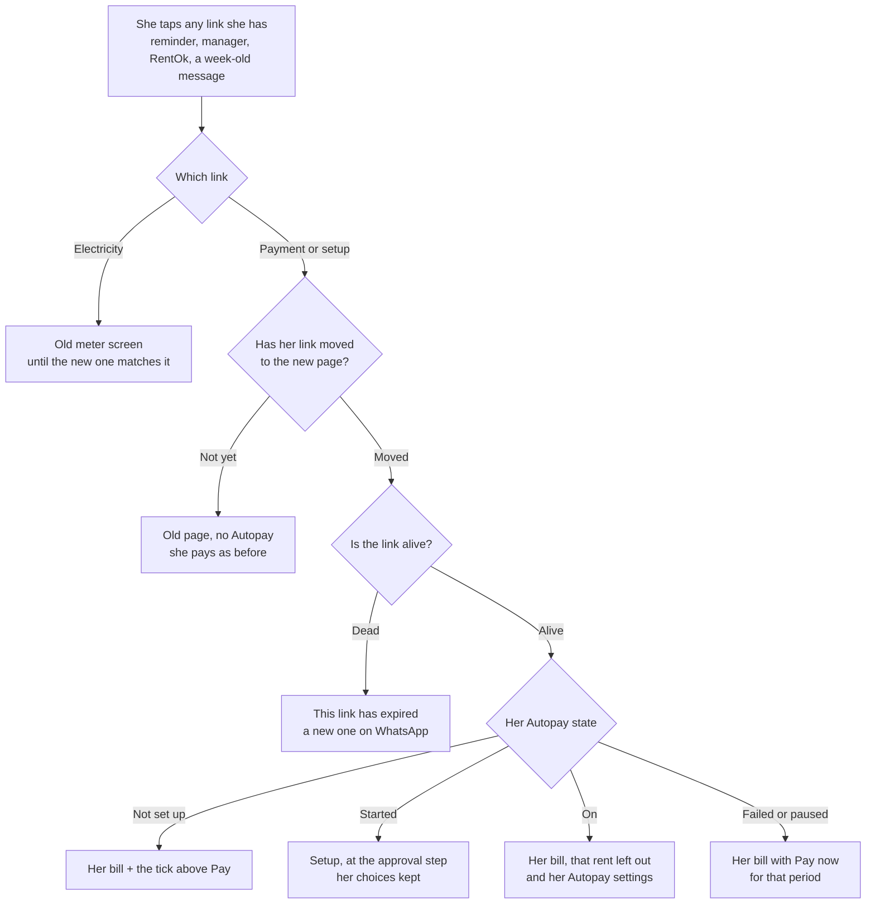
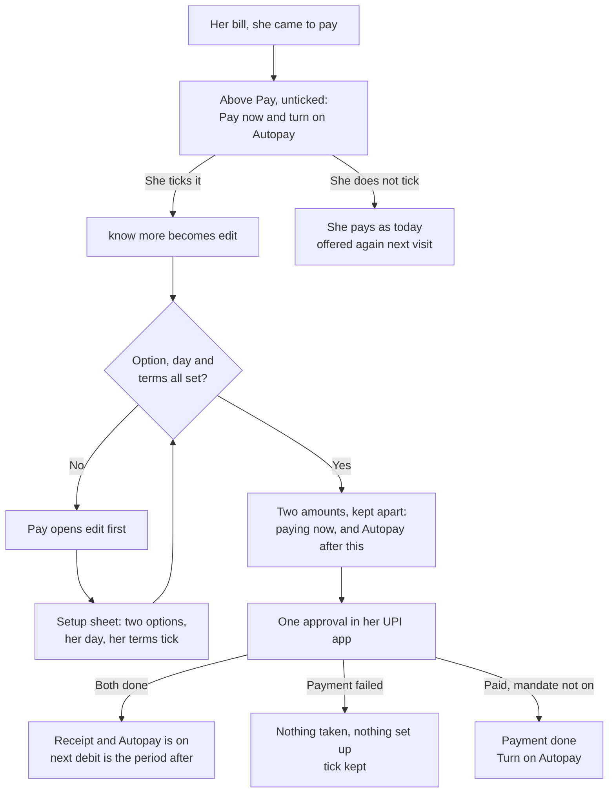
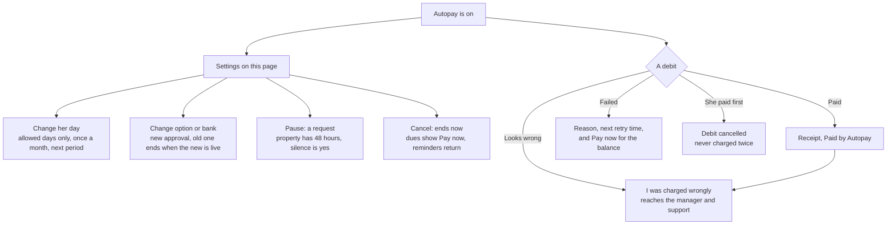

# Autopay: the payment page

The payment page seen whole. The build tickets A1 to A9, B1 to B4, C1, C2, D5 and E5 specify each
piece; they are organised by workstream, so nobody can currently see this surface end to end. This
page is that view, and it points at the ticket for every detail rather than repeating it.

**Read the ticket for what to build. Read this for what the surface is, what breaks today, what not
to touch, and what is still waiting on a person.**

Code was read on `eazypg-marketplace` origin/main `66b49dd0` and `rentok-backend` origin/master
`1498fcd62`, both on 22 September 2026. Issue states were checked the same day. **Checked against rulings R1 to R64.** Markers follow the
repo: **(agreed)** confirmed by Sanchay, **(proposed)** waiting on his yes.

---

## 1. The one rule

Outside check-in, this page **is** her Autopay (R52, one Autopay link per tenant). It is the only
door she gets, and it is the only place she can do anything herself, with no login, no app install
and no KYC wait.

So three things follow, and they decide every screen below.

**It must work from a link alone.** Whatever a ticket says happens "in the tenant app" happens here
first, because the app release comes after 1 Oct and the link does not.

**What this screen says is what RentOk may take.** The amounts, the day, the end date and the terms
she ticks are the consent record (A9, the terms and the saved record). Nothing may be computed in
the browser and nothing may exceed what she was shown.

**It must never price UPI.** No line anywhere on this page may name, size or rank a payment method
by what it costs RentOk. That is R63's fourth condition of 22 September, it is N2 and N6 in the
feature map, and it rests on the Finance Ministry UPI MDR FAQ Q34 (a merchant may not pass the UPI
charge to the customer). Section 8 is where this bites.

---

## 2. The map

| # | Surface | Today | Specified in | Ships |
| --- | --- | --- | --- | --- |
| 1 | Where every link lands | Every link opens the old page, which has no Autopay. The rewrite does not exist | **A8** | By 25 Sep |
| 2 | The bill, dues and history | Built and live on `/p2`. No Autopay reaches it | **A8**, **B1** | Live |
| 3 | The tick above Pay | Does not exist | **A2** | 1 Oct |
| 4 | Setup: two options, her day, her terms | A card exists and cannot set anything up | **A1**, **A9** | 1 Oct |
| 5 | The approval: her UPI apps, QR, UPI ID | Cashfree's hosted page | **A1** (R44) | 1 Oct |
| 6 | "Use bank account instead", e-NACH | Gated to one hardcoded property | **A1** | 1 Oct |
| 7 | Success screen | A check-in popup, not a screen | **A1**, **A2** | 1 Oct |
| 8 | The Autopay page behind "know more" | Does not exist | **A5** | 1 Oct, short version |
| 9 | Her Autopay settings | "Change the date with {manager}" on WhatsApp | **C1** | 1 Oct |
| 10 | Pause, resume | Does not exist | **C2** | 1 Oct |
| 11 | Cancel | A route with no login and no screen | **C1**, **S1** | 1 Oct |
| 12 | After a failed debit: pay the balance | Does not exist | **B3** | 1 Oct |
| 13 | Off the path: paid another way, refused, lower limit | Does not exist | **B4** | 1 Oct |
| 14 | "I was charged wrongly" | Does not exist | **B4**, **E3** | 1 Oct |
| 15 | Platform fee line on the bill and the receipt | Does not exist | **D5** | 1 Oct |
| 16 | Approve or pay manually, a payment request | Does not exist | **C4**. Deferred, section 9 | Deferred |
| 17 | A parent as payer | Does not exist | **A6** | 1 Oct |
| 18 | New approval after a rise, a rent change or a renewal | Does not exist | **C5**, **C6**, **A4** | 1 Oct |
| 19 | Share setup link on WhatsApp | The payment link share exists | **A4** | 1 Oct |
| 20 | Source tag, page events, privacy | Exclusion checks the wrong path; no events | **E5** | Before the push |
| 21 | Expired link, and a fresh one | Dies after 7 days, no re-send | **A8**, backend #6869 | 1 Oct |
| 22 | The UPI charge notice, six roads in cost order, the split session, the virtual account, RuPay detection, Rent Points and the Hubble store | Not built | **Not ticketed.** From Kamal's PRD and prototype | Section 8 |

**Row 22 is the only unticketed block, and it is the largest open question on this surface.** Six
ideas, all of them designed and in Kamal's PRD, four of which collide with a ruling. Section 8 sets
out each one and what it needs.

---

## 3. Three flows

`map/diagrams.md` already draws the tenant's whole journey (diagram 1) and every state a mandate can
be in (diagram 2). Use those. These three draw what only this page does.

### One link, five landings

A setup link works until she is set up, and a pay-now link after a failed debit or a paused month
works until her grace days end. Both are **(proposed)**, open question 7.

### Pay now and turn on Autopay, in one approval

Never pre-ticked (agreed). Today's payment is one time and may be larger than her limit; her limit
stays her regular dues (R46).

### After setup, this page is her Autopay

The manager can do none of this. He asks RentOk (R39), and he cannot pause or stop it himself.

---

## 4. Screen by screen

The ticket owns the states, the copy and the done-when list. This table carries only what the ticket
does not: what is already there, and what is already wrong with it.

| Surface | Ticket | What the ticket does not carry |
| --- | --- | --- |
| The link move | A8 | **No rewrite from the old address to the new one exists** in `middleware.js` on origin/main. Every blocker is still open, checked 22 Sep |
| The bill | A8, B1 | Built, with fourteen bench states and a `?debug` panel. Autopay is the one thing it cannot show |
| The tick above Pay | A2 | Not on the pay screen. The built page raises Autopay a different way, section 5 |
| Setup | A1, A9 | A day grid, a benefits list and one approve key exist and are unreachable. No option choice, no terms tick, no fee line, no parent |
| The approval | A1 | Check-in still hands her to Cashfree's page, which R44 rules out |
| e-NACH | A1 | Gated to one hardcoded property on the old checkout |
| Success | A1, A2 | The check-in popup says "complete" without checking the approval (marketplace#937) |
| Know more | A5 | Nothing like it exists. The card states terms as three facts, one of them wrong |
| Her settings | C1 | The only action offered is a WhatsApp message to her manager |
| Pause | C2 | Nothing. A pause she makes in her UPI app is recorded and never resumed (backend #7047) |
| Cancel | C1, S1 | The route exists, needs no login, and no screen calls it |
| Failed debit | B3 | The page has a `failed` state that no payload can reach, and the reason is always "Unknown failure" (#6817) |
| Off the path | B4 | Nothing. The rent Autopay will take is already left out of Pay all, which is the one guard that works |
| Charged wrongly | B4, E3 | Nothing, on any surface |
| Platform fee line | D5 | The word does not appear on the page or in Kamal's prototype. A limit approved without it goes short in October |
| Parent | A6 | Nothing. The page has no idea a payer can be someone else |
| New approval prompts | C5, C6, A4 | Nothing. A rise above her limit is silent here as it is everywhere |
| Share | A4 | "Share Payment link on WhatsApp" exists and is the pattern to copy |
| Counting and privacy | E5 | The page sends no product event, so no door can be measured on the day it fails |
| Expired link | A8, #6869 | One screen, one WhatsApp action, no re-send route |

---

## 5. What is broken today

Traced first-hand on 22 September 2026. None of this is in the tickets.

### The Autopay system on this page is finished, and reaches nobody

It is built: seven states, a day grid, a sheet, a moment sheet, benefits, a plan that keeps the
covered rent out of Pay all. Two independent things stop every one of them.

`CAN_SET_UP` is `false` (`components/PayPage/autopay.js:24`), so no state that asks anything of her
can render. And the payload has no Autopay in it: `state.js:260-272` maps an `autopay` object whose
own comment says none of the fields is sent yet, and
`rentok-backend src/controllers/tenant.ts:15082` confirms it, a response with no Autopay, no brand
name and no window (backend #6825). With `offered` false, `autopayView` returns `hidden` for every
tenant alive (`autopay.js:177`).

**So the finished work on this surface is one payload and one flag away from being visible, and both
are still open.**

### The page promises her rent date moves

"No late fines. The day you pick becomes your rent date." (`AutopayCard.jsx:43`, repeated at
`:80`), and in the sheet, "Any day works. The day you pick becomes your rent date." (`:175`).

That was R9, on 11 September. **R41 replaced it on 17 September:** her day runs from her rent due
day to the last of her grace days, and **her due date for late fines does not move.** The built page
makes her a promise the product no longer keeps, on the screen where she consents.

### Rent only

`state.js:356` fixes `covers: 'Rent only'`, printed twice as "{amount}, rent only"
(`AutopayCard.jsx:197`, `:286`). R18 widened that on 17 September and R46 replaced it: what she
approves is her regular dues, listed line by line, which is rent with GST, fixed recurring charges
and the platform fee line.

### Monthly only, and every day of the month

`eligible()` returns false for any rent that is not monthly (`autopay.js:162-169`), so quarterly,
yearly and manual-schedule tenants are refused, against R28. Filed as backend #7064 and still open.

The day grid takes an allowed window and disables the days outside it (`AutopayCard.jsx:93-95`), but
the window arrives from the payload, and the payload sends none. So `inWindow` is true for all 31
days, the line naming the property's window never renders (`:137-139`), and `openingDay` pre-picks
her habitual day without checking any window (`autopay.js:94-100`). R41 allows neither.

### The move to the new page has not started

Every Autopay screen above lives on `/p2`. Every link RentOk sends carries the old address, across
twelve backend files and 66 WhatsApp templates already approved by Meta. A8 rules the cheap fix: one
rewrite so the old address opens the new page. **There is no such rewrite on origin/main**, and its
blockers are all open on 22 Sep: marketplace#841 (eight verified gaps, three on the money path),
#773, #939, #862, #863.

R55 says this is finished by 25 Sep. That is three days, and nothing in the map is reachable by a
tenant until it is.

### Her link is usually dead before she opens it

Measured 13 Sep over 90 days: 8,025,999 payment links to 278,233 tenants, 28.8 each, **91.5%
already expired**. A new link is minted for every reminder and expires the older ones, so scrolling
up to the rent message, which is what a person does when she decides to pay, lands on a dead link
nearly every time. Backend #6869, open.

**The Autopay door and the dead link are the same link.** A setup message sent on 24 Sep that she
opens on 2 Oct opens nothing.

### The page cannot count, and may be recording her

`utils/gtag.js` excludes `/payment-pages`, but the router's own path is `/_sites/payment-pages/...`,
so the prefix never matches, Google Analytics probably runs, and Clarity has no exclusion at all
(marketplace#939). There is no product event anywhere in `components/PayPage/`. E5 needs both fixed
before any event ships, or the push starts by recording tenants' names, rooms and amounts.

### Cash on this page can be written twice

Not Autopay, but it is the same screen and the same money. A cash payment has no idempotency at any
layer, and its amount comes from the browser; the OTP authorises a person, not a payment
(backend #6871, P0, open). A2 adds a second write path to this screen, so it lands next to a hole.

---

## 6. Ship order

**Before anything else, and it is dated:** the link move (A8) and its five open blockers. Nothing on
this page reaches a tenant without it, and R55 puts it on 25 Sep.

**Backend before any screen:** the payload (#6825), the login fixes (#6816, #6861), the webhook
signature (#7019), the unset fee payer (#7054), non-monthly eligibility (#7064), the brand name
(#6883). Every one is open today.

**The page, by 1 Oct:** setup with the two options and the terms tick, the approval on our screen,
the tick above Pay, the success screen, her settings, the failed-debit state, the platform fee line,
the source tags and events.

**After 1 Oct, in the app release:** the same tick on the tenant app's own pay screen, and the app's
Autopay entry pointed at these settings instead of check-in.

---

## 7. Do not touch

**Do not price UPI anywhere on this page.** No charge named or sized like the 0.4% UPI charge, no
list of methods ordered by what they cost, no "free" tag against a method, nothing that tells her a
charge exists on one road and not another. R63's four conditions of 22 September, N2, N6, and
Finance Ministry FAQ Q34. It applies to the product, the owner screens and our own documents.

**Do not describe anything as a charge for Autopay.** The RBI e-mandate framework 2026, para 10(a),
bans a charge to the customer for availing the mandate. One tenant-facing charge exists, the
Platform fee, flat rupees, the same on every method including cash (R15, R26, R35). The old Autopay
setup and monthly fees are deleted and must not return.

**Do not change the amount in the browser.** Check-in computes `plan_amount` client-side today and
the server trusts it. The setup quote is the server's, and the browser sends her choices only.

**Do not ship the tick pre-ticked,** and do not ship a terms box that is ticked for her. Check-in
does both today (marketplace#935), which is what makes its consent challengeable.

**Do not turn events on before the exclusion is fixed** (#939), or the first thing the push records
is tenants' personal details.

---

## 8. Kamal's prototype, and the PRD behind it

Two documents from Kamal, read in full on 21 and 22 September: the launch room PRD, and a working
HTML prototype with sixteen screens built on this page's own design system. The prototype is good
work and most of it agrees with the map. Three groups.

### Take, because it is better than what we have written

- **One PIN.** This month's rent and the mandate in a single approval, which is A2 and R33, drawn.
- **The Autopay hub after setup** (`viewMandate`): the next three months, the parts a debit will
  take, and pause, stop and edit in one place. That is C1 and C2 with a shape.
- **The approval row**: her UPI apps opened directly, with a QR for a computer (R44, A1).
- **The parts shown at setup**, so a tenant above ₹15,000 sees two debits before she approves (R16).
- **e-NACH framed by amount**, "for rent above ₹15,000, one debit a month", with today's rent paid
  separately because the bank takes 24 to 48 hours.
- **The day grid reads a real window** from the property, which is exactly what R41 needs and what
  our own built page never receives.

### Do not take, because a ruling already says no

- **The UPI charge notice.** The prototype opens with a heading announcing the 0.4% charge and its
  amount on her bill, and the PRD says the first thing she reads is that UPI charges now apply.
  Against R11, N2 and R63's fourth condition.
- **Six roads in cost order with a fee against each.** Against R15 (the same for every method) and
  N6 (no method made cheaper).
- **The split session**, paying in parts under ₹2,000 against a 15 minute timer. That is N1,
  structuring. The PRD answers this: it says legal cleared it, that N1 only rules out splitting an
  Autopay mandate's rent, and that we will not advertise it as charge avoidance. The prototype then
  labels it "Pay in N parts under ₹2,000, no charge on the parts" and sorts it by cost under the
  charge notice, which is the advertising the PRD promised not to do.
- **Rent Points and the Hubble store**: points earned on every rupee of rent, a grant for setting up
  Autopay, and a voucher catalogue. Nothing in the map or the rulings has this. RentPass cashback is
  parked until a partner funds it, because RentOk absorbs nothing (R11).
- **"The day you pick becomes your rent date"**, which the prototype repeats from our own page. R41.

### Needs a ruling before anyone builds it

- **The virtual account.** Every tenant gets a permanent account number for NEFT, IMPS and RTGS. The
  map parks this until after 15 Oct and until Cashfree confirms how the money settles, and the legal
  check warns that rent landing in RentOk's own account is aggregation without a licence. The PRD
  says the Cashfree API is live and engineering can start now. Somebody has to rule.
- **RuPay card detection**, telling her a RuPay debit card carries no charge. Gateway charges are
  unchanged and separate (R34), but saying so on screen still prices one method against another.
- **Whether the page says anything at all about the charge.** This is the head of the list, and it
  is the one decision that sets the tone of the whole surface.

**The platform fee is missing from the prototype entirely.** A tenant who approves a limit without
it is short the moment October's line lands, and is asked to approve again in her first month. D5
and A1 both put the line inside what she approves, marked "from {date}" when it has not started.

---

## 9. Deferred, and what is waiting on a person

**Deferred: approve or pay manually, for a payment request (C4)** (agreed). It depends on what the
provider allows on an on demand mandate. Nothing else here depends on it.

**Everything unanswered lives in `decisions/open-questions.md`, not here.** Items 1 to 18 are
already there, and items 19 to 22 were added on 22 September from Kamal's PRD and prototype. The
four that block this surface most directly:

- whether this page names the UPI charge at all, where Kamal's PRD and the rulings disagree head on;
- whether the sub-₹2,000 split ships, given N1 and the PRD's answer to it;
- whether the virtual account is in or stays parked, and who confirms the licensing position;
- link life: how long a setup link and a pay-now link stay alive (item 7, already open, and now the
  thing standing between a setup message and a tenant).

**R64 is in the decision log** (added 22 Sep): one tenant-facing charge, the Platform fee, borne by the
tenant by default with management free to absorb it, the Autopay setup and monthly fees deleted, and
the amount suggested from the property's average rent rather than flat at ₹58.

---

## Where the rest lives

`map/feature-map.md` is the only document to build from. `decisions/decision-log.md` holds the
rulings, `decisions/open-questions.md` what is unanswered, `map/diagrams.md` the eight agreed
diagrams, `surfaces/manager-app.md` the manager's side of the same feature. Ticket drafts are in the
internal repo, with Kamal's PRD and prototype. Nothing here contradicts those; where it looks like
it does, they win and this is wrong.
