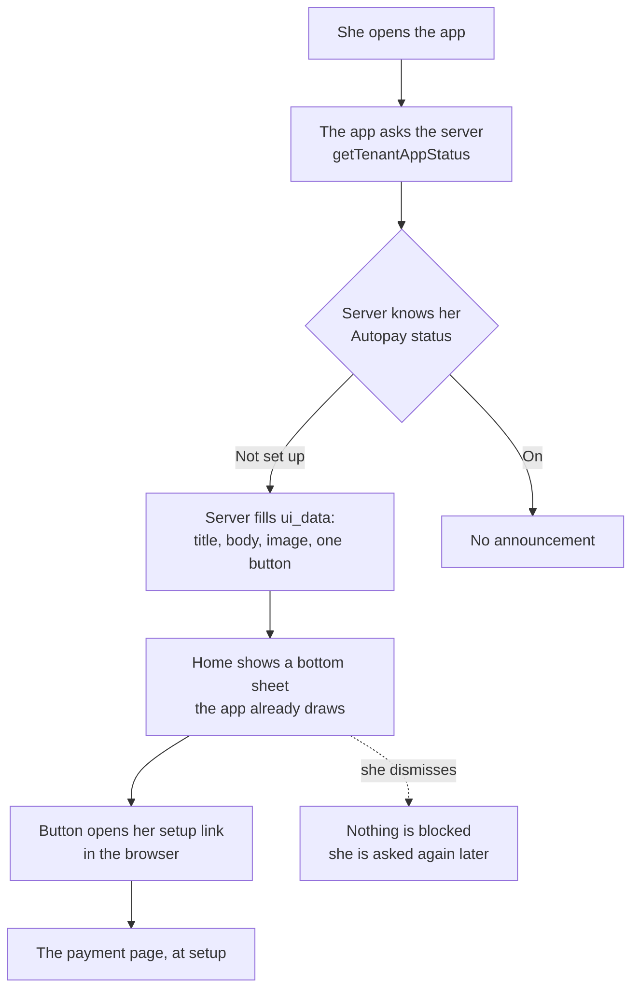
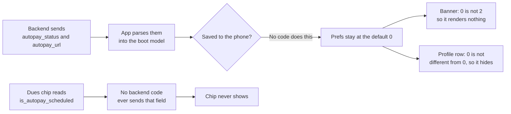
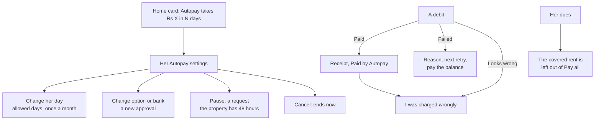

# Autopay: the tenant app

The tenant app seen whole. The build tickets A1 to A6, B1 to B4, C1 to C6 and D5 specify each piece;
they are organised by workstream, so nobody can currently see this surface end to end. This page is
that view, and it points at the ticket for every detail rather than repeating it.

**Read the ticket for what to build. Read this for what the surface is, what breaks today, what not
to touch, and what is still waiting on a person.**

Code was read on `rentok_tenant_package` origin/main `afea1abe` and `rentok-backend` origin/master
`1498fcd62`, both on 22 September 2026. Issue states were checked the same day. **Checked against rulings R1 to R64.** Markers follow the
repo: **(agreed)** confirmed by Sanchay, **(proposed)** waiting on his yes.

---

## 1. The one rule

**There are two tenant apps in this plan, and only one of them exists before 1 October.**

Nothing new enters the apps after the 18 September freeze, and `rentok_tenant_package` has had no
commit since 26 August. So for the push, this surface can do exactly one thing: whatever the server
can say through a screen the app already draws (R56, the server-sent home announcement). Every other
row in the map below is the app release after 1 Oct.

Two things follow, and they decide the whole surface.

**Before the release, the app is an output of the backend, not a build.** Any work that needs a new
screen, a new field saved on the phone or a new tap target is post-launch by definition. Planning it
into 1 Oct is planning a release that cannot happen.

**After the release, this app is the tenant's second self-service surface,** and it must match the
payment page rather than repeat it. The page is her Autopay for everyone outside check-in (R52). The
app is where she already is. Both show the same states; neither is allowed to be the only one.

---

## 2. The map

| # | Surface | Today | Specified in | Ships |
| --- | --- | --- | --- | --- |
| 1 | Home announcement, the bottom sheet | Exists, server-driven, used for "update your app" and a review ask | **A4** (R56) | **Before 1 Oct, server only** |
| 2 | Home announcement, the story tiles | Exists, property-authored, with seen tracking | Not used for Autopay | Not in scope |
| 3 | Dues screen: the Autopay setup banner | Built and **dark for every tenant**, section 5 | **A4** | Next release |
| 4 | Dues card: "Autopay Scheduled" chip | Built and **dark for every tenant**, section 5 | **B1** | Next release |
| 5 | Dues and Pay all | No idea a due is covered by Autopay | **B4**, **B1** | Next release |
| 6 | Pay now sheet: the tick | Does not exist | **A2** | Next release |
| 7 | Share the setup link | "Share Payment link on WhatsApp" exists and is the pattern | **A4** | Next release |
| 8 | Profile: "Autopay Details" row | Built, **dark**, and points at check-in, section 5 | **C1** | Next release |
| 9 | Her Autopay settings: see, change day, option, bank | Does not exist | **C1** | Next release |
| 10 | Pause, resume | Does not exist | **C2** | Next release |
| 11 | Cancel | Does not exist | **C1** | Next release |
| 12 | Failed debit: reason, retry time, pay the balance | Does not exist | **B3** | Next release |
| 13 | Off the path: paid another way, refused, lower limit | Does not exist | **B4** | Next release |
| 14 | "I was charged wrongly" on a debit | Does not exist | **B4**, **E3** | Next release |
| 15 | Receipt marked "Paid by Autopay", with parts | Does not exist | **B1** | Next release |
| 16 | Platform fee line on her bill and in the app | Does not exist | **D5** | Next release |
| 17 | Renewal ask, and "needs new approval" | Does not exist | **C5**, **C6** | Next release |
| 18 | Approve or pay manually, a payment request | Does not exist | **C4**. Deferred, section 9 | Deferred |
| 19 | A parent's card per child | **There is no parent app**, section 5 | **A6** (R24) | Needs a ruling |
| 20 | Electricity meter card | Exists and works | R30: she tops up herself | **Do not touch**, section 7 |
| 21 | Credits and RentPass cashback | Exists | Used before the debit, map step 1 | Next release |
| 22 | Autopay status saved on the phone | **Never written**, which is what makes rows 3, 4 and 8 dark | rentok_tenant_package#42 | Next release |

**Row 22 is the whole of rows 3, 4 and 8.** One missing write closes three doors. Row 19 is the only
row that needs a product decision before anyone can size it.

---

## 3. Three flows

`map/diagrams.md` already draws the tenant's journey (diagram 1) and every state a mandate can be in
(diagram 2). Use those. These three draw what only the app does.

### What the app can do before the next release

No app release is needed for any of this. The one slot is shared, section 5.

### Why all three in-app doors are dark

Three doors, one missing write and one missing field. Filed as rentok_tenant_package#42.

### Her Autopay in the app, after the release

Every one of these also exists on the payment page. The app adds no new rules, only a second place.

---

## 4. Screen by screen

The ticket owns the states, the copy and the done-when list. This table carries only what the ticket
does not: what is already there, and what is already wrong with it.

| Surface | Ticket | What the ticket does not carry |
| --- | --- | --- |
| Home announcement | A4 | **A4 records this as an unanswered engineering question. It is answered, section 5.** One slot, three claimants, last assignment wins |
| Setup banner | A4 | It exists and looks finished. An audit that reads screens will report it missing; it is dark, not absent |
| Autopay Scheduled chip | B1 | Reads a field no backend code sends. The label is already written and already correct |
| Dues and Pay all | B4 | **B4 says "the page" leaves the covered rent out. It says nothing about the app,** which has no such guard at all |
| The tick | A2 | The app's pay screen is native, so this one genuinely needs the release |
| Share | A4 | The wording already exists as a constant and is the pattern to copy |
| Profile row | C1 | It opens a freshly minted **check-in** link, which R52 forbids outside check-in |
| Settings, pause, cancel | C1, C2 | Nothing exists. A web view of the payment page settings is enough for the first release, which both tickets say |
| Failed debit | B3 | Nothing, and the reason is always "Unknown failure" until backend #6817 lands |
| Charged wrongly | B4, E3 | Nothing, on any surface |
| Receipts | B1 | The app shows no payment method on a receipt, so "Paid by Autopay" has nowhere to sit yet |
| Platform fee | D5 | D5 says the notice text is in her app. Nothing in the app renders it |
| Renewal, new approval | C5, C6 | Nothing |
| Parent | A6 | **A6 and R24 both route the parent through "the parent app". There is none**, section 5 |
| Electricity | R30 | Works. It must stay out of the debit, section 7 |

---

## 5. What is broken today

Traced first-hand on 22 September 2026, on `rentok_tenant_package` origin/main `afea1abe`.

### Three Autopay doors, all built, all dark

The backend computes the tenant's Autopay status and sends it with a link
(`rentok-backend src/controllers/tenant.ts:16429-16445`, origin/master). The app parses both
(`lib/models/profile_models/tenant_app_status_res.dart:25-26`) and **never saves either one**. A
search for writes to those two preference keys returns nothing; every hit is a read.

`PrefsUtils.getInt` returns **0** when a key was never written (`lib/utils/prefs_utils.dart:104-109`).
So the same missing write closes two doors in opposite directions:

- the dues banner shows only when the value is 2, and 0 is not 2, so it renders an empty box
  (`lib/presentation/accounts/widgets/autopay_setup_banner.dart:16`);
- the profile row shows only when the value is not 0, and it is 0, so it hides
  (`lib/presentation/profile/sections/profile_options_section/profile_options_section.dart:165`).

The third door is a different wire. The dues card prints an "Autopay Scheduled" chip when
`is_autopay_scheduled` is true (`lib/presentation/accounts/dues/accounts_dues_card.dart:94-102`),
and **no backend code sends that field at all**; a search of `src` on origin/master returns nothing.

All three are rentok_tenant_package#42, open. Its line numbers have drifted since 18 September; the
Autopay block is at `tenant.ts:16429` today.

**Why this matters beyond three widgets.** The same pattern holds on the payment page, where the
whole Autopay system is built and reaches nobody. RentOk has more Autopay interface built than it
has wired. A screen audit reports all of it as missing and sizes a build; the real work is a payload,
a flag and a saved value. It also cuts the other way: wiring is fast, and a wire turned on today
would publish wording that three rulings have since replaced.

### The one live door leads to the wrong place

When the status is 1 or 2, the server makes a live HTTP call on **every app open** to mint a fresh
short link, and returns `https://rentok.com/checkin/{link}` as her Autopay link
(`tenant.ts:16429-16445`).

That is a check-in link. R52 says a tenant still in check-in sets Autopay up inside check-in and
**everyone else gets the payment page**, and today those links open check-in at step 1, behind KYC
(backend #7056). So the app's only Autopay door, once it is unblocked, sends an existing tenant into
a flow built for a new one.

### The app can ask her to pay rent that Autopay is about to take

The payment page works out which open rent row the next debit covers and leaves it out of "Pay all".
The app has no such idea: `is_autopay_scheduled` is the only signal it has, and nothing sends it.

So a tenant on Autopay who opens the app sees her rent as payable and can pay it. The debit then
runs anyway, because the field that would skip it is never written (backend #7002, open, P1). The
backend half of this is filed. **The app half is not specified anywhere:** B4 puts the guard on
"the page" and says nothing about the app.

### The parent has no app

R24 and A6 both route the parent through "the parent app and WhatsApp". WhatsApp exists. **There is
no parent app and no parent mode.** The tenant app holds a local guardian's name, phone and address
as fields on her own profile (`lib/models/profile_models/edit_tenant_model.dart:27-29`), which is a
contact, not a login and not a payer.

A6 is otherwise buildable, because its real doors are WhatsApp and a shared link. But its step 1 and
its "a card per child in the parent app" describe an app nobody has, and A6 is a P0 in the cut order.

### The announcement question A4 leaves open is answerable, and the answer is yes

A4 records this as unverified: whether the current app's home announcement can be targeted by
Autopay status and carry a tappable link. Both are true.

`ui_data` is built per tenant on the server inside `getTenantAppStatus`, in the same function where
her Autopay status is already in scope, and it carries a title, body, image, a dismissible flag and
buttons; a button with the intent `web` and a `url` opens a link, which is how the "Update App"
sheet already works. The app draws it as a bottom sheet on the home page
(`lib/presentation/base/basepage.dart:352-375`).

**The constraint to design around: it is one slot, and the last assignment wins.** Three claimants
already write to it in that function (`tenant.ts:16364`, `:16398`, `:16455`), the last being a
review request. An Autopay announcement has to be ordered against those two, or it will be silently
overwritten for exactly the tenants who also owe a review.

---

## 6. Ship order

**Before 1 Oct, server only, no app release:** the home announcement (R56), targeted by Autopay
status, ordered against the update-app and review sheets, with its button pointing at her payment
page link and **not** at check-in.

**Backend, before that announcement is worth sending:** her Autopay link must be the payment page
(R52, #7056), and the payment page must open the new page at all, which is the payment page
document's first item and is dated 25 Sep.

**The app release after 1 Oct, in this order:** save the status and the link (#42), which lights
three doors at once; her settings, pause and cancel as a web view of the payment page, which both
C1 and C2 accept for the first release; the covered rent left out of Pay all; then the tick on the
pay screen, the failed-debit state, receipts and the platform fee line.

---

## 7. Do not touch

**The electricity meter card.** Prepaid recharges are never taken by a debit; she tops up herself
(R30). The card works today and must stay outside every Autopay change.

**`autopay_status` on the boot response is an integer, and it is one of three fields with that
name.** The others are the property's config and the manager app's per-tenant flag. The new Autopay
states are new words for new screens and **must not be sent on any of the three**. A string arriving
on this one fails the tenant app's boot path, because the evicted-tenant redirect rides the same
response (`tenant_app_status_res.dart:25`). Flutter releases are not forced, so a broken boot stays
broken on every phone that does not update.

**Do not describe anything as a charge for Autopay,** and do not price UPI anywhere in the app. One
tenant-facing charge exists, the Platform fee, flat rupees, the same on every method including cash
(R15, R26, R35, R63's fourth condition).

**Do not add a second announcement claimant without ordering it.** One slot, last write wins.

---

## 8. Where this surface and the payment page must agree

Both are the tenant's own surfaces, and R45 gives her the same self-service on each. Everything in
this list is one behaviour with two renderings, never two behaviours.

| Behaviour | Payment page | Tenant app |
| --- | --- | --- |
| See her Autopay, option, day, limit, end date | C1, by 1 Oct | C1, next release |
| Change her day | C1, by 1 Oct | C1, next release |
| Pause and resume | C2, by 1 Oct | C2, next release |
| Cancel | C1, by 1 Oct | C1, next release |
| The covered rent left out of Pay all | Built and working | **Not specified anywhere**, section 5 |
| Failed debit, reason and retry | B3, by 1 Oct | B3, next release |
| "I was charged wrongly" | B4, by 1 Oct | B4, next release |
| The platform fee line | D5, by 1 Oct | D5, next release |
| The terms she agreed to | A9, by 1 Oct | A9, next release |

The first release of the app screens may be a web view of the payment page settings, which is what
C1 and C2 both propose. That is the cheapest way to keep this table honest, and it is a design
decision nobody has ruled.

---

## 9. Deferred, and what is waiting on a person

**Deferred: approve or pay manually, for a payment request (C4)** (agreed). Nothing here depends on
it.

**Everything unanswered lives in `decisions/open-questions.md`, not here.** Items 1 to 22 are there
already. Item 23 was added on 22 September from this surface:

- **the parent app does not exist**, so A6's parent door is WhatsApp and a shared link only, unless
  a parent mode is built in the tenant app or a parent app is started.

Two more things on this surface are somebody's call and are recorded in the tickets rather than as
open questions, because they are build decisions and not product ones: whether the app's first
Autopay screens are a web view of the payment page, and where an Autopay announcement sits against
the update-app and review sheets in the one slot they share.

**R64 is in the decision log** (added 22 Sep): one tenant-facing charge, the Platform fee, borne by the
tenant by default with management free to absorb it, the Autopay setup and monthly fees deleted, and
the amount suggested from the property's average rent rather than flat at ₹58.

---

## Where the rest lives

`map/feature-map.md` is the only document to build from. `decisions/decision-log.md` holds the
rulings, `decisions/open-questions.md` what is unanswered, `map/diagrams.md` the eight agreed
diagrams. `surfaces/manager-app.md` and `surfaces/payment-page.md` are the other two surfaces, and
the payment page one matters most here, because this app's first release borrows its screens.
Ticket drafts are in the internal repo. Nothing here contradicts those; where it looks like it does,
they win and this is wrong.
