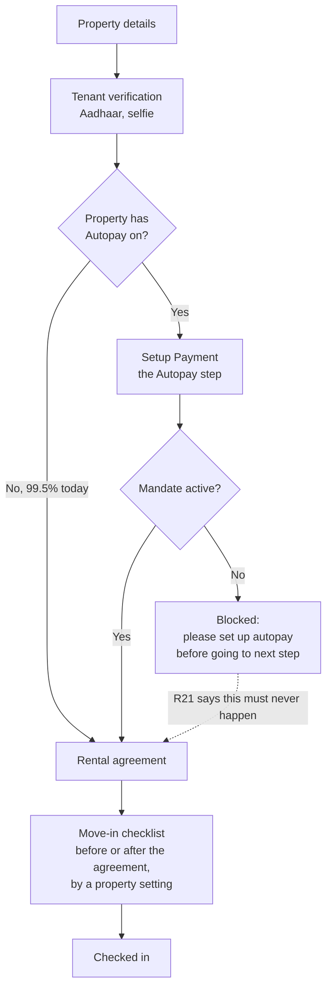
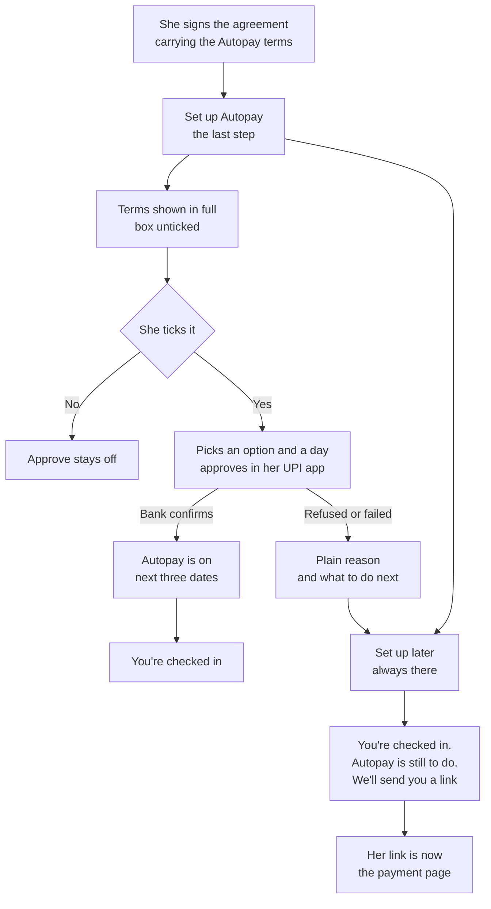

# Autopay: web check-in

Web check-in seen whole. The build ticket A3 specifies this surface, with A1, A4, A9, D2, D4, D5,
E2, E5 and S1 touching it; they are organised by workstream, so nobody can currently see the surface
end to end. This page is that view, and it points at the ticket for every detail rather than
repeating it.

**Read the ticket for what to build. Read this for what the surface is, what breaks today, what not
to touch, and what is still waiting on a person.**

Code was read on `eazypg-marketplace` origin/main `66b49dd0` and `rentok-backend` origin/master
`1498fcd62`, both on 22 September 2026. Production figures were run the same day. Issue states
checked the same day. **Checked against rulings R1 to R65.** Markers follow the repo:
**(agreed)** confirmed by Sanchay, **(proposed)** waiting on his yes.

---

## 1. The one rule

**This is the only surface where a tenant can be blocked, and today it blocks.**

`isTabComplete` returns true for the Autopay step only when a mandate is already active
(`pages/checkin/[checkinId].js:158`, origin/main), and the message is "Please set up autopay before
going to next step" (`:169`). A tenant who cannot approve a mandate cannot reach her agreement, her
move-in checklist, or the end of check-in.

R21 is the rule she is entitled to: **required means chase, never block.** Every other surface obeys
it because none of them can hold anything back. A payment page that fails still lets her pay. An app
card that never renders costs her nothing. **Check-in is the one place where our defect becomes her
locked door**, and she is standing in the building when it happens.

Two things follow.

**Autopay comes after the agreement, never before it** (A3, and the map's "first contact"). Today it
comes before: the Autopay tab is pushed at `:110` and the agreement at `:131`. A mandate authorised
before the document that governs it is signed is a consent problem, not an ordering preference.

**This is also the only Autopay door that needs no app release and no link migration.** The manager
app and the tenant app wait for a release after 1 October. The payment page waits for every live
link to move to the new page. Check-in is a web page whose links already point at it. **It is the
shortest path there is from a fix to a live tenant**, and it is the door every new tenant walks
through.

---

## 2. The map

| # | Surface | Today | Specified in | Ships |
| --- | --- | --- | --- | --- |
| 1 | The step order | Autopay before the agreement | **A3**, marketplace#943 | By 1 Oct |
| 2 | The Autopay step itself | Exists, gated on the property flag | **A3**, **A1** | By 1 Oct |
| 3 | The setup screen inside the step | Its own component, not the shared one | **A1** | By 1 Oct |
| 4 | Two options, her day, her amounts | One day picker, rent only, browser-computed amount | **A1**, **A3** | By 1 Oct |
| 5 | The terms box | Ticked for her, and the checkbox is commented out | **A9**, **A3**, marketplace#935 | By 1 Oct |
| 6 | The Autopay clause in the agreement | No agreement template mentions Autopay | **A9**, **D5** | By 1 Oct, wording waits on a lawyer |
| 7 | The platform fee line at check-in | Shown as a struck-out "one-time" setup fee | **D5**, **A3**, marketplace#938 | By 1 Oct |
| 8 | "Set up later" | Hidden when Autopay is mandatory | **A3**, marketplace#915 | By 1 Oct |
| 9 | The forward gate | Blocks until a mandate is active | **A3** (R21) | By 1 Oct |
| 10 | The approval, and coming back | Cashfree's hosted page; the result is fetched and never read | **A1** (R44), **A3**, marketplace#937 | By 1 Oct |
| 11 | Failure states | One spinner, no message | **A3**, marketplace#936 | By 1 Oct |
| 12 | Resume at the Autopay step | `?tab=autopay` works; **no sender uses it** | **A4**, backend#7056 | By 1 Oct |
| 13 | The tenant-level excuse, with a reason | Does not exist anywhere | **A3** (R38), **D1** | Web 1 Oct, app next |
| 14 | "Send bank-account setup" | Does not exist | **A3** | Web 1 Oct |
| 15 | ₹0 rent | Button disabled, no way past | **A3**, marketplace#915 | By 1 Oct |
| 16 | Counting this door | No source tag, no events | **E5**, **E4** | Before the push |
| 17 | The old subscription routes | The confirmation step still calls them | **S1**, backend#7039 | Security gate, first |

**Nine issues block this surface and every one of them was open on 22 September:** marketplace#943,
#915, #935, #936, #937, #938 and backend#7054, #7056, #7039.

---

## 3. Two flows

`map/diagrams.md` draws the tenant's journey and the mandate states. These two draw what only
check-in does.

### The step order, and the gate

The checklist sits in one of two places depending on a property setting, so "Autopay last" and
"Autopay after the agreement" are not the same instruction. A3 asks for both and the map does not
settle it. **Proposed: Autopay is the last step, whatever the checklist setting**, because the
screen she leaves on should be the one that tells her what happens next month.

### What she should meet instead

"Set up later" is always present and check-in always finishes (R21). After it, her one Autopay link
is the payment page, not check-in (R52).

---

## 4. Screen by screen

The ticket owns the states, the copy and the done-when list. This table carries only what the ticket
does not: what is there today, and what is already wrong with it.

| Surface | Ticket | What the ticket does not carry |
| --- | --- | --- |
| Step order | A3 | The checklist has two possible positions, so "last" and "after the agreement" can disagree |
| The step gate | A3 | It is the only R21 violation in the product that can stop a person mid-task |
| Setup screen | A1 | Check-in has its own component and its own copy, so every A1 fix has to be made twice until it is replaced |
| Terms box | A9, #935 | The checkbox is commented out and the value starts true, so the guard that reads it can never fire |
| Agreement clause | A9, D5 | No agreement template in the repo mentions Autopay at all |
| Fee line | D5, #938 | Shown as a struck-out setup fee, which is the old model R11 deleted |
| Set up later | A3, #915 | Hidden exactly where it is needed, at a property that requires Autopay |
| Approval return | A1, #937 | The result is fetched into a variable and never read; the success dialog opens on the address alone |
| Failure | A3, #936 | No try or catch, so the spinner is the whole error experience |
| Resume | A4, #7056 | The page already supports opening at the Autopay step and no sender builds that link |
| The excuse | A3 (R38) | Does not exist on any screen, though the rulings assume a manager can grant it |
| Counting | E5 | No source tag on the check-in door, so this door cannot be told from any other in the daily numbers |
| Old routes | S1, #7039 | The live confirmation step is one of the two callers keeping a P0 route alive |

---

## 5. What is broken today, and what happens when it is turned on

Traced first-hand on 22 September 2026.

### Almost nobody sees this step, and that is the whole risk

`is_autopay` is a **four-account hardcoded allowlist, or the property's own flag**
(`rentok-backend src/controllers/tenant.ts:8359`, origin/master), and `is_autopay_mandatory` is a
**one-account allowlist, or the property's flag** (`:8362`). In production today, **438 of 85,591
properties have Autopay on, which is 0.51%**, and 283 of those also have it mandatory.

So the Autopay step appears in about one check-in in two hundred, and the blocking gate bites at
283 properties plus one hardcoded account.

**First order.** D4 and R20 turn Autopay on and required by default for every property. The step
goes from 0.5% of check-ins to all of them in one deploy.

**Second order.** Six open defects that today reach a handful of tenants a day begin reaching
**1,774 a day**, which is what August ran at, and rising: 40,900 new tenants in June, 51,131 in
July, 53,206 in August. Two of the six are not cosmetic. #915 blocks check-in outright where Autopay
is mandatory. #935 records that she agreed to terms she was never shown.

**Third order.** A blocked check-in is not a lost conversion. It is a person standing in a building
who cannot finish moving in, which arrives as a call to the manager, then as a complaint to the
owner, then as a reason to stop using RentOk for check-in at all. The surface with the smallest
audience today is the one with the largest blast radius on the day of the switch.

**So the ship order inverts.** The six check-in fixes are not parallel work with D4's default-on;
they are its precondition. The map's build order already puts check-in at step 3 and setup at step 4
(R10), and this is why.

**What it does not change:** nothing here touches the payment page, the manager app or the tenant
app, and none of them gates on this. The 99.5% of properties that see no Autopay step today see no
change until D4 lands.

### Consent is collected before the document that governs it

The Autopay tab is pushed at `pages/checkin/[checkinId].js:110` and the agreement at `:131`, so she
authorises a bank mandate, then signs the agreement that is meant to carry its terms
(marketplace#943). Alongside it, `termsAccepted` starts `true` (`components/autoPayDetails.js:22`)
and the checkbox is commented out, so the tick she never made is sent as a yes, and no agreement
template in the repo mentions Autopay.

**Second order.** Three defects that each look small combine into one: no clause in the agreement,
no visible tick, and the mandate taken first. There is no artefact anywhere that shows what she
agreed to. A9 exists to produce one, and at check-in it has nothing to attach to.

**Third order.** The one place in the product with a real signing ceremony is the one place Autopay
does not use it. Fixing the order is not a UX tidy-up; it is what makes the agreement the consent
record and makes A9's job at every other door easier, because check-in becomes the reference.

### The browser still decides the amount, and the success screen does not check

`plan_amount` is computed in the page from the tenant's rent plus a fee the browser works out
(`components/autoPayDetails.js:66`), and the server trusts it. On the way back from Cashfree the
subscription is fetched into a variable that is then never read, and the "Autopay Setup Complete!"
dialog opens whenever the address carries a subscription id
(`pages/checkin/[checkinId].js:1044`, the dialog opened at `:1107-1108` after `setDefaultIndex(2)` at `:1102`, text at `:1503`).

**Second order.** A tenant who backs out of her UPI app is told she is done, and the manager's list
will later disagree with her screen. That is the shape of the disputes E3 has to handle, manufactured
at setup.

### It keeps a P0 route alive

The confirmation step calls the old `/payment/getSubscriptionDetails`
(`pages/checkin/[checkinId].js:1044`). Those older subscription routes charge any tenant's bank and
read or overwrite her mandate with no login (backend#7039, P0, open). S1 cannot switch them off while
a live screen still calls them.

**Third order.** The security gate is the first item in the build order (R10), and one line in this
file is one of the two things holding it. Moving this caller is small work that unblocks the gate
that everything else waits behind.

### One more `autopay_status`, this time as a query alias

`getCheckIn` selects the property's flag as `p.autopay_status` aliased onto the tenant row
(`tenant.ts:7916`), so `tenant?.autopay_status` at `:8359` is the property's setting, not the
tenant's. That is a fourth thing wearing the name, after the property config, the tenant app field
and the manager app's per-tenant flag. Section 7 of `surfaces/manager-app.md` has the rule; it
applies here too.

---

## 6. Ship order

**First, and it unblocks the rest:** move the confirmation step off the old subscription routes so
S1 can close the security gate (backend#7039).

**Before D4 turns Autopay on by default, not alongside it:** the six check-in defects, in this
order. "Set up later" always present and check-in always finishing (#915). A real terms box, shown
and saved (#935). The success dialog reading the actual status (#937). A message instead of a
spinner (#936). The step after the agreement (#943). The fee line corrected (#938).

**With A1:** replace the check-in component's body with the shared setup screen, so the two doors
stop drifting.

**Backend, alongside:** the tenant-level excuse and its reason (R38), every sender building
`?tab=autopay` while she is in check-in and the payment page link after "Set up later" (#7056, R52),
and the unset fee payer (#7054).

**Manager web, by 1 Oct:** the excuse switch and "Send bank-account setup" on the tenant profile.
**Manager app:** the same two, in the release after 1 October.

---

## 7. Do not touch

**Do not turn Autopay on by default before the six fixes land.** That is the whole of section 5.

**Do not let the Autopay step block anything.** "Set up later" is always present and check-in always
finishes, whatever the property requires (R21). A property may require Autopay; it may not require
it of a tenant who is standing in the building.

**Do not record a tick she did not make.** The box starts unticked, it blocks approval, and the
version and time are saved with it (R60). This is the one defect on this surface with a legal edge.

**Do not compute the amount in the browser.** The server owns the amount; the page sends her
choices.

**Do not describe the fee as a charge for Autopay, or as one-time.** One tenant-facing charge
exists, the Platform fee, fixed rupees, the same on every method including cash, and the amount is
suggested from the property's average rent (R15, R26, R35, and Sanchay's instruction of 22 Sep).
The old Autopay setup and monthly fees are deleted and must not return.

**Do not send a string on `autopay_status`.** Four things carry that name, one of them a query alias
here. The rule is in `surfaces/manager-app.md` section 7.

---

## 8. What this surface does not touch

- **It does not gate any other surface.** The payment page, the manager app and the tenant app all
  work whether or not check-in is fixed.
- **It does not reach existing tenants**, who are about 300,000 of the target's pool and arrive
  through the payment page, WhatsApp and the app instead. Check-in is 18,000 to 29,000 by 1 Oct on
  the map's estimate, and August's run rate of 1,774 a day puts it in the upper half of that.
- **It does not change any ruling**, and nothing here needs R64 settled.
- **It does not depend on the payment page link move**, on any app release, or on any Cashfree
  answer. Every blocker on this surface is ours.

---

## 9. What is waiting on a person

**On Sanchay**, three of them specific to this surface and all marked (proposed) in A3:

- whether Autopay is the last step or the step straight after the agreement, when the move-in
  checklist is set to come after the agreement;
- what she sees at ₹0 rent, where today the button is simply disabled;
- what an excused tenant sees: no step at all, or a step that says Autopay is not needed for her.

**Everything else unanswered lives in `decisions/open-questions.md`**, items 1 to 28. The two that
reach this surface hardest are 6, the brand a whitelabelled tenant sees, which is 19.5% of tenants
and blocks the setup copy, and 28, the Platform fee ladder, because the fee is shown here before she
signs.

**On an adviser:** the Autopay clause in the agreement, with a payments lawyer. It is the only
surface where the wording has a signature attached to it.

**R64 is now in the decision log** (22 Sep), the one tenant-facing charge and its amount suggested from the property's average rent.

---

## Where the rest lives

`map/feature-map.md` is the only document to build from. `decisions/decision-log.md` holds the
rulings, `decisions/open-questions.md` what is unanswered, `map/diagrams.md` the eight agreed
diagrams. The other surfaces are `surfaces/manager-app.md`, `surfaces/payment-page.md` and
`surfaces/tenant-app.md`; the payment page one matters most here, because after "Set up later" her
Autopay link becomes that page. Ticket drafts are in the internal repo. Nothing here contradicts
those; where it looks like it does, they win and this is wrong.
